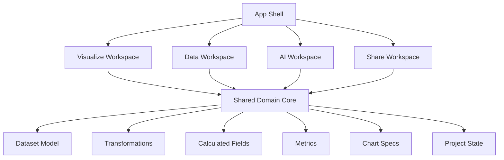
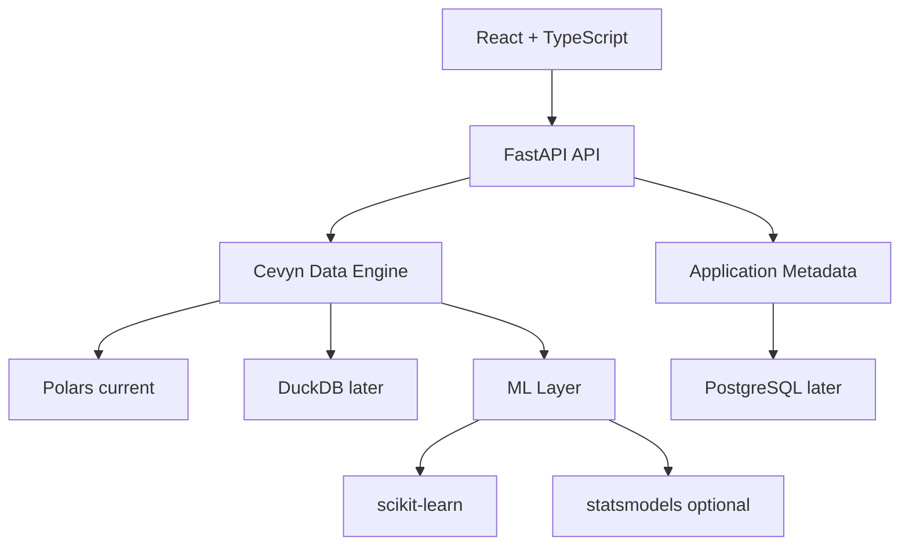
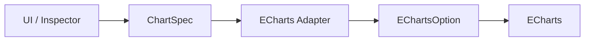
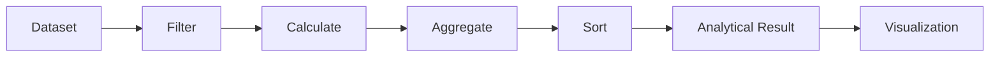
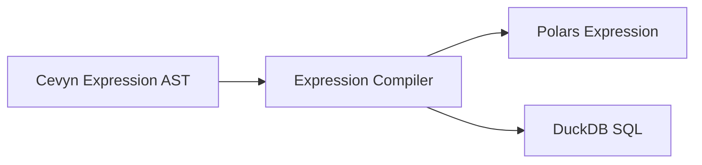
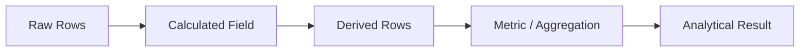
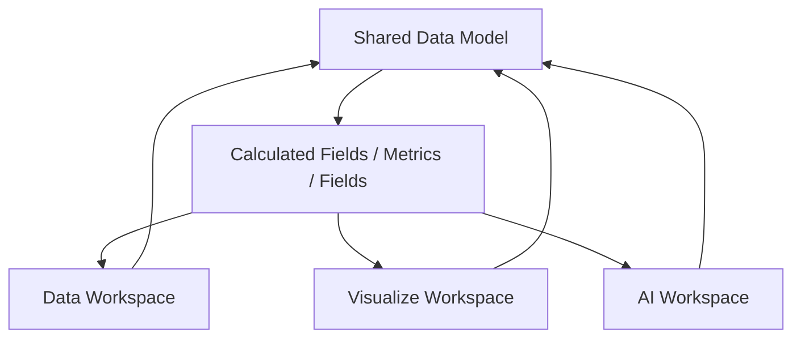
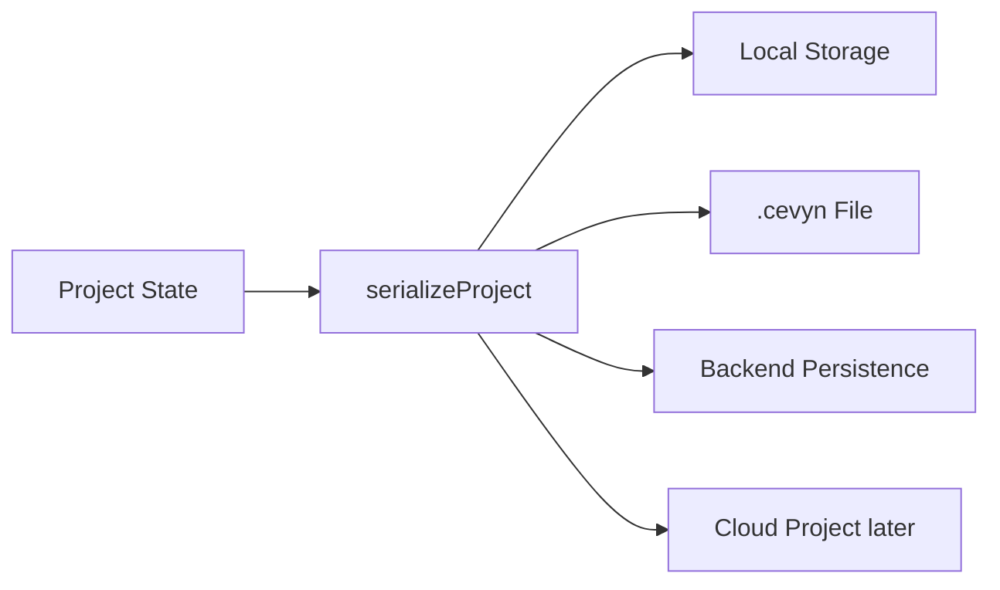

# Cevyn – Architecture

## 1. Architekturziele

Die Architektur von Cevyn soll:

- modular bleiben;
- externe Libraries vom Domain Model trennen;
- mehrere Workspaces auf einem gemeinsamen Core ermöglichen;
- Visualisierungen unabhängig vom Renderer beschreiben;
- Data Transformations unabhängig von der Execution Engine definieren;
- Project State serialisierbar halten;
- spätere Persistenz und `.cevyn`-Dateien ermöglichen.

Cevyn wird zunächst als modularer Monolith entwickelt.

Microservices sind aktuell nicht vorgesehen.

## 2. High-Level Product Architecture



Workspaces sind unterschiedliche UX-Kontexte.

Sie verwenden keine voneinander isolierten Datenmodelle.

## 3. App Shell

Die langfristige App Shell besteht aus:

```text
AppShell
├── TopBar
├── NavigationRail
└── ActiveWorkspace
```

Die Navigation Rail wechselt zwischen Workspaces.

Ein Workspace ersetzt den zentralen Arbeitsbereich.

Data oder AI werden nicht als zusätzliche horizontale Panels neben
Build Panel, Canvas und Inspector geöffnet.

### Visualize

```text
Navigation Rail
│
└── Visualize Workspace
    ├── Build Panel
    ├── Canvas
    └── Inspector
```

### Data

```text
Navigation Rail
│
└── Data Workspace
    ├── Data View
    ├── Profile
    └── Transformations
```

### AI

```text
Navigation Rail
│
└── AI Workspace
    ├── Forecast
    ├── Clustering
    ├── Anomaly Detection
    ├── Regression
    └── Classification
```

## 4. Technical Stack

Aktueller bzw. geplanter Stack:

### Frontend

- React
- TypeScript
- Vite
- Apache ECharts
- dnd-kit
- Custom CSS
- Lucide React

Zustandsmanagement kann bei wachsender Komplexität zentralisiert
werden. Zustandstechnologie ist eine Implementierungsentscheidung und
nicht Teil des Domain Models.

### Backend

- FastAPI
- Python
- Polars für CSV-Daten und gruppierte Chart-Abfragen

Datasets liegen aktuell als Polars-DataFrames im In-Memory-Store.
Line- und Bar-Charts nutzen serverseitige Gruppierungsaggregationen.
Scatter rendert bisher einen begrenzten Ausschnitt der Rohdaten.

Langfristig vorgesehen:

- DuckDB
- NumPy
- scikit-learn
- optional statsmodels
- PyTorch nur bei konkretem Bedarf

PostgreSQL kann später für Application Metadata und persistente
Projects verwendet werden.

## 5. Technical Architecture



Polars ist bereits im Einsatz. DuckDB ist noch nicht eingeführt.

Die Data Engine soll so strukturiert werden, dass die aktuelle
Execution Engine später ausgetauscht oder erweitert werden kann.

## 6. Chart Architecture

ECharts ist Rendering Engine und nicht das Cevyn-Produktmodell.

Der zentrale Datenfluss lautet:



Regel:

```text
UI
→ Cevyn Domain Model
→ Renderer Adapter
→ Renderer
```

Raw ECharts Options sollen nicht unkontrolliert über React-Komponenten
verteilt werden.

### ECharts Adapter

Renderer-spezifischer Code liegt unter `src/chart/echarts`.

`createEChartOption` ist ein kleiner Orchestrator. Er kombiniert allgemeine
Optionen wie Titel, Tooltip, Legend und Interaktion mit dem
charttypspezifischen Content.

Chart-Content wird über eine typsichere Registry erzeugt:

```text
ChartType
→ ChartContentBuilder
→ Series sowie optionale Visual Maps und Achsen
```

Aktuell existieren getrennte Builder für:

- Scatter-Content auf Basis der geladenen Rohdaten;
- aggregierten Line-/Bar-Content auf Basis des Backend-Resultsets.

Neue Charttypen erhalten einen eigenen Builder oder verwenden einen
gemeinsamen Builder, wenn Datenvertrag und Renderingstruktur tatsächlich
identisch sind. Die Registry stellt sicher, dass jeder `ChartType` einem
Builder zugeordnet ist.

## 7. ChartDefinition vs. ChartSpec

### ChartDefinition

Beschreibt Regeln eines Charttyps.

Beispiele:

- verfügbare Encodings;
- kompatible Semantic Types;
- verfügbare Inspector Properties;
- Defaults;
- Aggregation Rules.

### ChartSpec

Beschreibt die konkrete Instanz einer Visualisierung.

Beispiel:

```text
Line Chart

X = Date
Y = Revenue
Series = Country
Aggregation = Sum
```

ChartDefinition ist die Regel.

ChartSpec ist die konkrete Konfiguration.

## 8. Chart Instances

Für Multi-Chart-Dashboards sollen Visualisierung und Layout getrennt
bleiben.

Konzeptionell:

```ts
type ChartLayout = {
  x: number
  y: number
  width: number
  height: number
}

type ChartInstance = {
  id: string
  type: ChartType
  spec: ChartSpec
  layout: ChartLayout
}
```

Langfristig:

```text
Workspace
├── charts: ChartInstance[]
└── selectedChartId
```

Der Inspector arbeitet auf dem selektierten Objekt.

## 9. Inspector Architecture

Chart Inspector:

```text
Inspector
├── Data
├── Appearance
└── Interaction
```

### Data

Beschreibt, welche Daten verwendet werden.

Beispiele:

- X
- Y
- Color
- Size
- Series
- Aggregation
- Stack
- Sort

### Appearance

Beschreibt visuelle Darstellung.

Beispiele:

- Mark / Series
- Labels
- Grid
- Axes
- Legend
- Color Scale

### Interaction

Beschreibt Verhalten.

Beispiele:

- Tooltip
- Hover / Emphasis
- Zoom
- Selection
- Animation
- Legend Interaction

## 10. Encoding Semantics

Diskrete und kontinuierliche Encodings müssen unterschieden werden.

### Discrete

Beispiel:

```text
Color = Country
```

Darstellung:

```text
Legend
```

### Continuous

Beispiel:

```text
Color = Revenue
```

Darstellung:

```text
Color Scale
```

ECharts kann dafür intern `visualMap` verwenden.

Der Begriff `visualMap` soll jedoch nicht das Cevyn Domain Model
bestimmen.

### Color Channel Ownership

Ein explizites Color-Encoding besitzt Vorrang vor Series:

- numerisches Color verwendet eine kontinuierliche Color Scale;
- diskretes Color verwendet eine kategorische Palette und Legend;
- ohne Color kann Series den kategorischen Farbkanal übernehmen.

Series bleibt bei gleichzeitigem numerischem Color als Gruppierung erhalten,
besitzt aber nicht mehr den Farbkanal. Deshalb wird in diesem Fall keine
farbige Series-Legend angezeigt.

## 11. Data Architecture

Der analytische Datenfluss lautet grundsätzlich:



Nicht jeder Workflow benötigt jeden Schritt.

### Aggregated Chart Query

Line- und Bar-Charts verwenden ein gruppiertes Backend-Resultset. Der Request
enthält:

- `x` und `y`;
- optional `series`;
- `aggregation` für den Y-Wert;
- optional `color` und `color_aggregation`.

Das Resultset enthält pro Gruppe:

- `x`;
- optional `series`;
- `value`;
- optional `color_value`.

`color_value` ist ein zusätzlich aggregiertes Ergebnisfeld und verändert
weder die Gruppierung noch `value`. Color darf dasselbe Feld wie Y mit einer
eigenen Aggregation redundant codieren, aber nicht dasselbe Feld wie X oder
Series verwenden.

## 12. Calculated Fields

Calculated Fields sind Row-Level Expressions.

Beispiel:

```text
Home Goals + ":" + Away Goals
→ Result
```

Die Definition soll unabhängig von Python, Polars oder SQL gespeichert
werden.

Konzeptionelles AST:

```ts
{
  type: "concat",
  values: [
    {
      type: "field",
      field: "home_goals"
    },
    {
      type: "literal",
      value: ":"
    },
    {
      type: "field",
      field: "away_goals"
    }
  ]
}
```

Execution:



Die konkrete Engine kann sich ändern, ohne das gespeicherte
Calculated Field zu verändern.

## 13. Calculated Fields vs. Metrics



Calculated Field:

```text
row → row
```

Metric:

```text
rows → aggregated value
```

## 14. Semantic Types

Physical Type und Semantic Type sollen getrennt betrachtet werden.

Beispiele Physical Types:

- integer
- float
- string
- boolean
- date
- datetime

Beispiele Semantic Types:

- numeric
- categorical
- temporal
- identifier

Später möglich:

- geographic
- text

Chart-Kompatibilität soll primär auf Semantic Types basieren.

## 15. Compatibility

Fields können für einen Slot unterschiedliche Kompatibilität besitzen:

```text
recommended
supported
invalid
```

Inkompatible Fields sollen nicht zwingend global versteckt werden.

Drop Targets können den Zustand visuell kommunizieren.

## 16. Workspace Data Sharing

Alle Workspaces verwenden denselben Shared Core.



Beispiel:

Ein Calculated Field, das in Cevyn Data erzeugt wurde, steht direkt in
Visualize zur Verfügung.

Ein ML-Ergebnis wie `cluster_id` kann später wiederum als Field für
Visualisierungen verwendet werden.

## 17. Project State

Langfristiges Domain Model:

```text
Project
├── Dataset[]
├── Transformation[]
├── CalculatedField[]
├── Metric[]
├── Visualization[]
├── Dashboard[]
└── Analysis[]
```

Ein Wert soll möglichst einmal definiert und anschließend
wiederverwendet werden.

Beispiel:

```text
Profit = Revenue - Cost

├── Bar Chart
├── KPI
└── Forecast
```

## 18. Persistence

Project State soll serialisierbar bleiben.

Dadurch können unterschiedliche Persistence Targets denselben State
verwenden.



Gegenrichtung:

```text
deserializeProject()
→ Project State
→ React renders Workspace
```

## 19. `.cevyn` Project Format

Die erste Version kann ein JSON-basiertes Format sein.

Beispiel:

```json
{
  "format": "cevyn",
  "version": 1,
  "project": {},
  "datasets": [],
  "dashboard": {}
}
```

Von Anfang an muss eine Formatversion vorhanden sein.

```text
format
version
```

Dadurch können später Migrationspfade für ältere Projektdateien
implementiert werden.

Langfristig kann `.cevyn` ein Container sein:

```text
project.cevyn
├── manifest.json
├── project.json
├── dashboard.json
├── data/
│   └── dataset.parquet
└── assets/
    └── image.png
```

Diese Containerstruktur ist kein MVP-Ziel.

## 20. Architekturprinzip

Bei neuen Features zuerst fragen:

> Gehört diese Funktion in das bestehende Domain Model oder entsteht
> gerade unnötig eine zweite parallele Struktur?

Gemeinsame Konzepte sollen zentral modelliert und von mehreren
Workspaces wiederverwendet werden.
