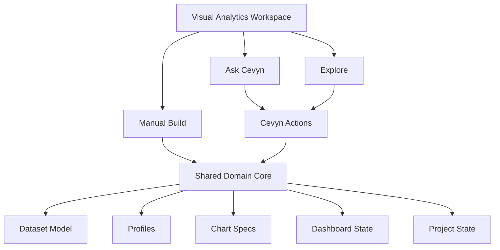
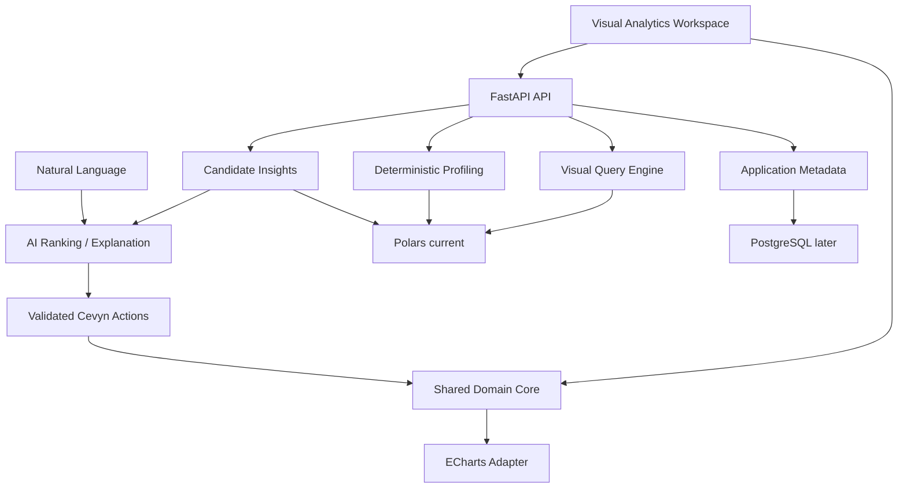
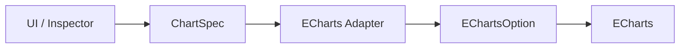
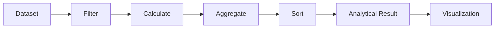
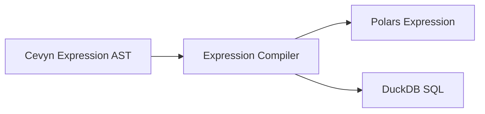
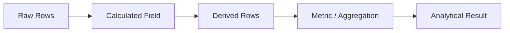
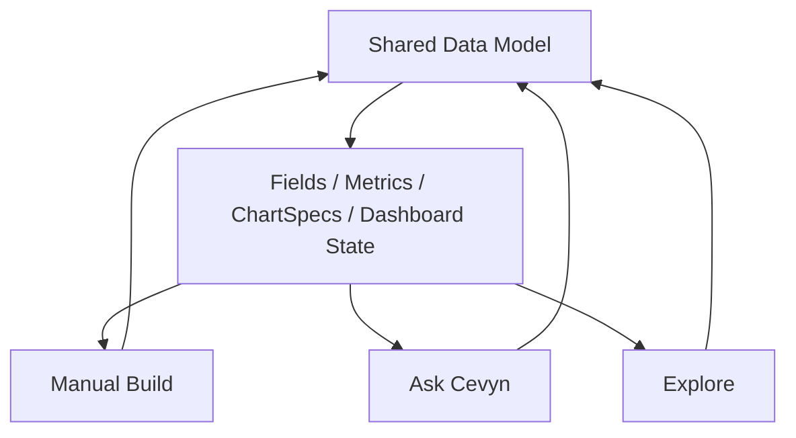
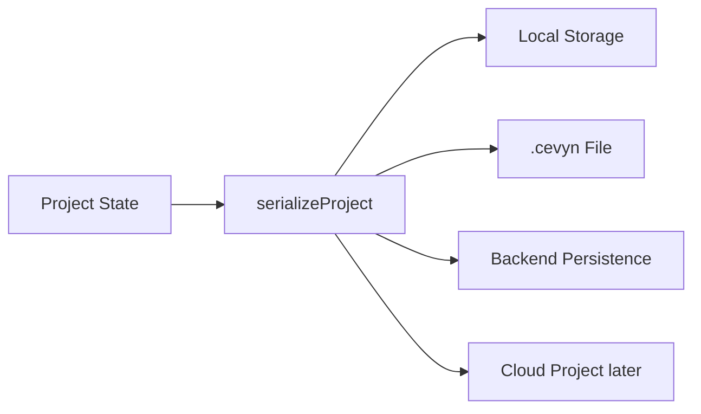

# Cevyn – Architecture

## 1. Architekturziele

Die Architektur von Cevyn soll:

- modular bleiben;
- externe Libraries vom Domain Model trennen;
- mehrere Produktmodi auf einem gemeinsamen Core ermöglichen;
- Visualisierungen unabhängig vom Renderer beschreiben;
- Data Handling auf Visual Analytics begrenzen;
- AI über validierte Cevyn Actions in den Core integrieren;
- Project State serialisierbar halten;
- spätere Persistenz und `.cevyn`-Dateien ermöglichen.

Cevyn wird zunächst als modularer Monolith entwickelt.

Microservices sind aktuell nicht vorgesehen.

## 2. High-Level Product Architecture



Die Produktmodi sind unterschiedliche Zugänge zum selben Workspace.
Sie verwenden keine voneinander isolierten Datenmodelle.

## 3. App Shell

Die langfristige App Shell rahmt einen gemeinsamen
Visual-Analytics-Workspace:

```text
AppShell
├── TopBar
└── VisualAnalyticsWorkspace
    ├── Build Panel
    ├── Canvas
    └── Inspector
```

Data Understanding, Ask Cevyn und Explore werden als integrierte Modi
oder fokussierte Ansichten angebunden. Sie bilden keine unabhängige
Suite neben dem Visual-Analytics-Workspace.

### Manual Build

```text
Build Panel
→ Canvas
→ Inspector
```

### Ask Cevyn

```text
Natural Language
→ validated Cevyn Actions
→ ChartSpec / Dashboard State
```

### Explore

```text
Deterministic Candidate Insights
→ AI Ranking / Explanation
→ ChartSpec
```

## 4. Technical Stack

Aktueller bzw. geplanter Stack:

### Frontend

- React
- TypeScript
- Vite
- Apache ECharts
- dnd-kit
- Custom CSS
- Lucide React

Zustandsmanagement kann bei wachsender Komplexität zentralisiert
werden. Zustandstechnologie ist eine Implementierungsentscheidung und
nicht Teil des Domain Models.

### Backend

- FastAPI
- Python
- Polars für CSV-Daten und gruppierte Chart-Abfragen

Datasets liegen aktuell als Polars-DataFrames im In-Memory-Store.
Line-, Bar-, Pie- und Donut-Charts nutzen serverseitige
Gruppierungsaggregationen.
Scatter rendert bisher einen begrenzten Ausschnitt der Rohdaten.

Bei konkretem Bedarf vorgesehen:

- DuckDB
- NumPy, scikit-learn oder statsmodels für klar begrenzte statistische
  und spätere ML-Erweiterungen der visuellen Analyse

PostgreSQL kann später für Application Metadata und persistente
Projects verwendet werden.

## 5. Technical Architecture



Polars ist bereits im Einsatz. DuckDB ist noch nicht eingeführt.

Backend-Komponenten bleiben auf Profiling, Visual Queries, leichte
Transformationen und Candidate Generation begrenzt. Eine andere
Execution Engine wird erst bei einem konkreten Skalierungsbedarf
eingeführt.

AI erzeugt keine ECharts-Optionen. AI-Ausgaben werden als Cevyn Actions
validiert und verändern ausschließlich das bestehende Domain Model.

## 6. Chart Architecture

ECharts ist Rendering Engine und nicht das Cevyn-Produktmodell.

Der zentrale Datenfluss lautet:



Regel:

```text
UI
→ Cevyn Domain Model
→ Renderer Adapter
→ Renderer
```

Raw ECharts Options sollen nicht unkontrolliert über React-Komponenten
verteilt werden.

### ECharts Adapter

Renderer-spezifischer Code liegt unter `src/chart/echarts`.

`createEChartOption` ist ein kleiner Orchestrator. Er kombiniert allgemeine
Optionen wie Titel, Tooltip, Legend und Interaktion mit dem
charttypspezifischen Content.

Chart-Content wird über eine typsichere Registry erzeugt:

```text
ChartType
→ ChartContentBuilder
→ Series sowie optionale Visual Maps und Achsen
```

Aktuell existieren getrennte Builder für:

- Scatter-Content auf Basis der geladenen Rohdaten;
- aggregierten Line-/Bar-Content auf Basis des Backend-Resultsets.

Neue Charttypen erhalten einen eigenen Builder oder verwenden einen
gemeinsamen Builder, wenn Datenvertrag und Renderingstruktur tatsächlich
identisch sind. Die Registry stellt sicher, dass jeder `ChartType` einem
Builder zugeordnet ist.

## 7. ChartDefinition vs. ChartSpec

### ChartDefinition

Beschreibt Regeln eines Charttyps.

Beispiele:

- verfügbare Encodings;
- kompatible Semantic Types;
- verfügbare Inspector Properties;
- Defaults;
- Aggregation Rules.

### ChartSpec

Beschreibt die konkrete Instanz einer Visualisierung.

Beispiel:

```text
Line Chart

X = Date
Y = Revenue
Series = Country
Aggregation = Sum
```

ChartDefinition ist die Regel.

ChartSpec ist die konkrete Konfiguration.

## 8. Chart Instances

Für Multi-Chart-Dashboards sollen Visualisierung und Layout getrennt
bleiben.

Konzeptionell:

```ts
type ChartLayout = {
  x: number
  y: number
  width: number
  height: number
}

type ChartInstance = {
  id: string
  type: ChartType
  spec: ChartSpec
  layout: ChartLayout
}
```

Langfristig:

```text
Workspace
├── charts: ChartInstance[]
└── selectedChartId
```

Der Inspector arbeitet auf dem selektierten Objekt.

## 9. Inspector Architecture

Chart Inspector:

```text
Inspector
├── Data
├── Appearance
└── Interaction
```

### Data

Beschreibt, welche Daten verwendet werden.

Beispiele:

- X
- Y
- Color
- Size
- Series
- Aggregation
- Stack
- Sort

### Appearance

Beschreibt visuelle Darstellung.

Beispiele:

- Mark / Series
- Labels
- Grid
- Axes
- Legend
- Color Scale

### Interaction

Beschreibt Verhalten.

Beispiele:

- Tooltip
- Hover / Emphasis
- Zoom
- Selection
- Animation
- Legend Interaction

## 10. Encoding Semantics

Diskrete und kontinuierliche Encodings müssen unterschieden werden.

### Discrete

Beispiel:

```text
Color = Country
```

Darstellung:

```text
Legend
```

### Continuous

Beispiel:

```text
Color = Revenue
```

Darstellung:

```text
Color Scale
```

ECharts kann dafür intern `visualMap` verwenden.

Der Begriff `visualMap` soll jedoch nicht das Cevyn Domain Model
bestimmen.

### Color Channel Ownership

Ein explizites Color-Encoding besitzt Vorrang vor Series:

- numerisches Color verwendet eine kontinuierliche Color Scale;
- diskretes Color verwendet eine kategorische Palette und Legend;
- ohne Color kann Series den kategorischen Farbkanal übernehmen.

Series bleibt bei gleichzeitigem numerischem Color als Gruppierung erhalten,
besitzt aber nicht mehr den Farbkanal. Deshalb wird in diesem Fall keine
farbige Series-Legend angezeigt.

## 11. Data Architecture

Der Datenfluss ist auf Visual Analytics begrenzt. Er unterstützt
Verständnis, Visual Queries und leichte Vorbereitung, aber keine
allgemeinen ETL-Pipelines.



Nicht jeder Workflow benötigt jeden Schritt.

### Deterministic Profiling

Profiling wird zunächst im Python-Backend ausgeführt:

```text
Dataset
→ Physical und Semantic Types
→ Summary Statistics
→ Missing Values und Duplicates
→ Profile Result
```

Profile Results sind deterministische Datenprodukte. AI kann sie
priorisieren und erklären, berechnet sie aber nicht selbst.

### Aggregated Chart Query

Line-, Bar-, Pie- und Donut-Charts verwenden ein gruppiertes
Backend-Resultset. Der Request enthält:

- `x` und `y`;
- optional `series`;
- `aggregation` für den Y-Wert;
- optional `color` und `color_aggregation`.

Das Resultset enthält pro Gruppe:

- `x`;
- optional `series`;
- `value`;
- optional `color_value`.

`color_value` ist ein zusätzlich aggregiertes Ergebnisfeld und verändert
weder die Gruppierung noch `value`. Color darf dasselbe Feld wie Y mit einer
eigenen Aggregation redundant codieren, aber nicht dasselbe Feld wie X oder
Series verwenden.

### Explore Candidate Pipeline

Explore verwendet denselben Daten- und Chartpfad wie manuell erstellte
Visualisierungen:

```text
Dataset und Profile Results
→ Python Candidate Generation
→ Candidate Insights
→ AI Ranking / Explanation
→ validated Cevyn Actions
→ ChartSpec
→ ECharts Adapter
```

Candidate Generation bleibt deterministisch. AI priorisiert und
erklärt Kandidaten, erzeugt aber weder analytische Ergebnisse noch
direkten ECharts-Code.

## 12. Calculated Fields

Calculated Fields sind Row-Level Expressions.

Sie bleiben auf leichte Ableitungen begrenzt, die für Encodings,
Aggregationen und visuelle Analyse benötigt werden.

Beispiel:

```text
Home Goals + ":" + Away Goals
→ Result
```

Die Definition soll unabhängig von Python, Polars oder SQL gespeichert
werden.

Konzeptionelles AST:

```ts
{
  type: "concat",
  values: [
    {
      type: "field",
      field: "home_goals"
    },
    {
      type: "literal",
      value: ":"
    },
    {
      type: "field",
      field: "away_goals"
    }
  ]
}
```

Execution:



Die konkrete Engine kann sich ändern, ohne das gespeicherte
Calculated Field zu verändern.

## 13. Calculated Fields vs. Metrics



Calculated Field:

```text
row → row
```

Metric:

```text
rows → aggregated value
```

## 14. Semantic Types

Physical Type und Semantic Type sollen getrennt betrachtet werden.

Beispiele Physical Types:

- integer
- float
- string
- boolean
- date
- datetime

Beispiele Semantic Types:

- numeric
- categorical
- temporal
- identifier

Später möglich:

- geographic
- text

Chart-Kompatibilität soll primär auf Semantic Types basieren.

## 15. Compatibility

Fields können für einen Slot unterschiedliche Kompatibilität besitzen:

```text
recommended
supported
invalid
```

Inkompatible Fields sollen nicht zwingend global versteckt werden.

Drop Targets können den Zustand visuell kommunizieren.

## 16. Shared State Across Product Modes

Alle Produktmodi verwenden denselben Shared Core.



Eine manuelle Änderung, ein AI Command und ein Explore-Vorschlag
erzeugen dieselben Actions und ChartSpecs. Dadurch bleiben Ergebnisse
editierbar und zwischen den Modi konsistent.

## 17. Project State

Langfristiges Domain Model:

```text
Project
├── Dataset[]
├── DataProfile[]
├── LightTransformation[]
├── CalculatedField[]
├── Metric[]
├── ChartInstance[]
├── Dashboard[]
├── SharedFilter[]
└── SelectionState
```

Ein Wert soll möglichst einmal definiert und anschließend
wiederverwendet werden.

Beispiel:

```text
Profit = Revenue - Cost

├── Bar Chart
├── KPI
└── Dashboard Filter
```

## 18. Persistence

Project State soll serialisierbar bleiben.

Dadurch können unterschiedliche Persistence Targets denselben State
verwenden.



Gegenrichtung:

```text
deserializeProject()
→ Project State
→ React renders Workspace
```

## 19. `.cevyn` Project Format

Die erste Version kann ein JSON-basiertes Format sein.

Beispiel:

```json
{
  "format": "cevyn",
  "version": 1,
  "project": {},
  "datasets": [],
  "dashboard": {}
}
```

Von Anfang an muss eine Formatversion vorhanden sein.

```text
format
version
```

Dadurch können später Migrationspfade für ältere Projektdateien
implementiert werden.

Langfristig kann `.cevyn` ein Container sein:

```text
project.cevyn
├── manifest.json
├── project.json
├── dashboard.json
├── data/
│   └── dataset.parquet
└── assets/
    └── image.png
```

Diese Containerstruktur ist kein MVP-Ziel.

## 20. Architekturprinzip

Bei neuen Features zuerst fragen:

> Gehört diese Funktion in das bestehende Domain Model oder entsteht
> gerade unnötig eine zweite parallele Struktur?

Gemeinsame Konzepte sollen zentral modelliert und von Manual Build,
Ask Cevyn und Explore wiederverwendet werden.
