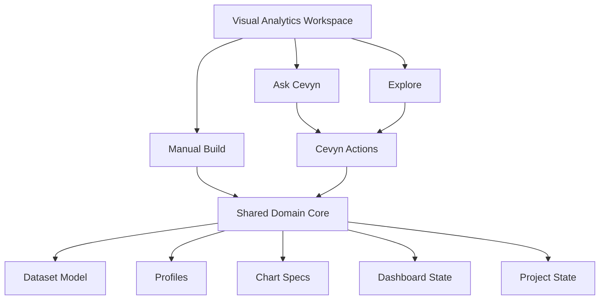
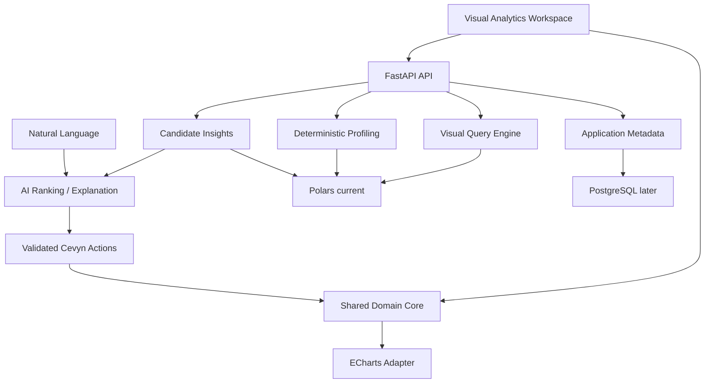
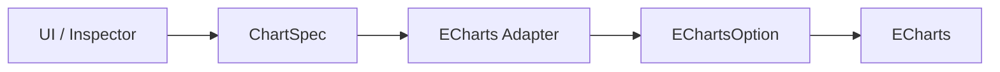
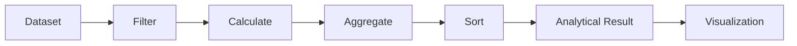
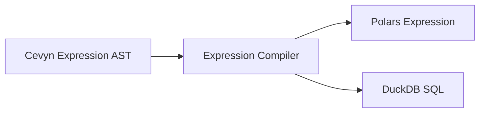
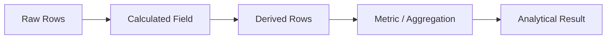
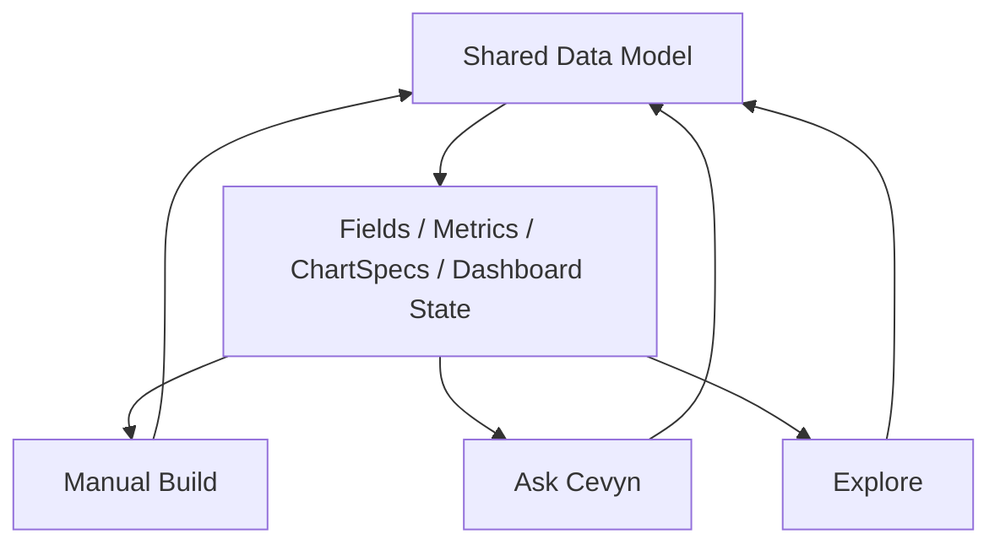
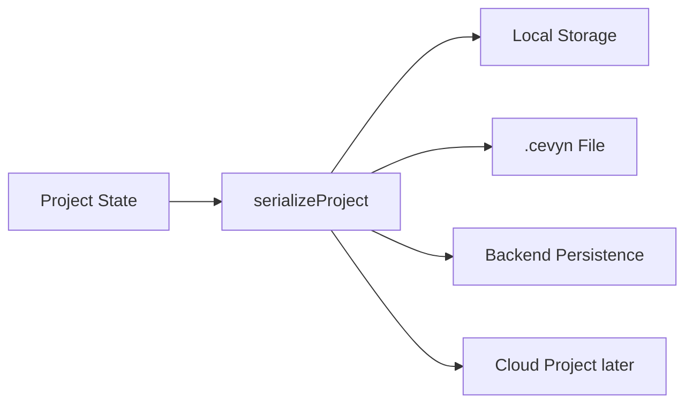

# Cevyn – Architecture

## 1. Architekturziele

Die Architektur von Cevyn soll:

- modular bleiben;
- externe Libraries vom Domain Model trennen;
- mehrere Produktmodi auf einem gemeinsamen Core ermöglichen;
- Visualisierungen unabhängig vom Renderer beschreiben;
- Data Handling auf Visual Analytics begrenzen;
- AI über validierte Cevyn Actions in den Core integrieren;
- Project State serialisierbar halten;
- spätere Persistenz und `.cevyn`-Dateien ermöglichen.

Cevyn wird zunächst als modularer Monolith entwickelt.

Microservices sind aktuell nicht vorgesehen.

## 2. High-Level Product Architecture


```mermaid
flowchart TB
    Shell[Visual Analytics Workspace]

    Shell --> Manual[Manual Build]
    Shell --> Ask[Ask Cevyn]
    Shell --> Explore[Explore]

    Manual --> Core[Shared Domain Core]
    Ask --> Actions[Cevyn Actions]
    Explore --> Actions
    Actions --> Core

    Core --> Dataset[Dataset Model]
    Core --> Profile[Profiles]
    Core --> Charts[Chart Specs]
    Core --> Dashboard[Dashboard State]
    Core --> Project[Project State]
```

Die Produktmodi sind unterschiedliche Zugänge zum selben Workspace.
Sie verwenden keine voneinander isolierten Datenmodelle.

## 3. App Shell

Die App Shell rahmt die Workspaces über eine globale TopBar und eine
Navigation Rail:

```text
AppShell
├── TopBar (Branding, später Workspace/Team, Account, Settings)
└── AppBody
    ├── NavigationRail (Top-Level-Views)
    └── Active View
        ├── Visualize Workspace
        │   ├── Build Panel
        │   ├── Canvas
        │   └── Inspector
        └── Data Workspace
            └── Data Panel (Profile | Table)
```

Der aktive Workspace (`WorkspaceView`) ist UI-State in
`useWorkspaceLayout`, nicht Teil des Workspace-Reducers und nicht
undo-fähig. Beide Workspaces bleiben gemountet und werden über `hidden`
umgeschaltet, damit Chart-Instanzen und lokaler UI-Zustand erhalten
bleiben.

Data und Visualize arbeiten auf demselben Dataset. `useDatasets` lädt
beim Start das Demo-Dataset aus dem Backend und nach einem Upload das
neue Dataset; Summary und `DatasetProfile` werden gemeinsam geladen und
gemeinsam gesetzt. Rows lädt das Frontend nicht als Ganzes: jede Ansicht
fragt im Backend genau das ab, was sie zeigt (Table: eine Seite Rows,
aggregierte Charts: Gruppen, Scatter: ein Sample). Der Data Workspace
hat keine eigene Dataset- oder Upload-Logik. Profile-Ansicht und Build Panel gruppieren
Fields über das `DatasetProfile` und dieselben Semantic Role Overrides
(siehe Abschnitt 11); die Table View liest daraus Role, Physical Type
und Verteilung. Ask Cevyn nutzt es als Kontext für Claude (siehe Ask
Cevyn).

Die Table lädt Rows seitenweise über die Table Query und rendert nur
die sichtbaren Zeilen; Sortierung und Table Filter laufen im Backend
über den ganzen Datensatz (siehe Table Query).

Ask Cevyn und Explore werden als integrierte Modi oder fokussierte
Ansichten angebunden. Sie bilden keine unabhängige Suite neben dem
Visual-Analytics-Workspace.

### Manual Build

```text
Build Panel
→ Canvas
→ Inspector
```

### Ask Cevyn

```text
Natural Language
→ validated Cevyn Actions
→ ChartSpec / Dashboard State
```

### Explore

```text
Deterministic Candidate Insights
→ AI Ranking / Explanation
→ ChartSpec
```

## 4. Technical Stack

Aktueller bzw. geplanter Stack:

### Frontend

- React
- TypeScript
- Vite
- Apache ECharts
- dnd-kit
- Custom CSS
- Lucide React

Zustandsmanagement kann bei wachsender Komplexität zentralisiert
werden. Zustandstechnologie ist eine Implementierungsentscheidung und
nicht Teil des Domain Models.

### Backend

- FastAPI
- Python
- Polars für CSV-Daten und gruppierte Chart-Abfragen
- Anthropic Python SDK für AI Commands (Claude Sonnet 5.5)

Datasets liegen aktuell als Polars-DataFrames im In-Memory-Store.
Das Demo-Dataset ist ein reguläres Backend-Dataset: `demo.csv` wird beim
Start über `lifespan` mit der festen ID `demo` registriert, über
denselben Weg wie ein Upload (`read_csv_frame`, `register_dataset`).
Line-, Bar-, Pie- und Donut-Charts nutzen serverseitige
Gruppierungsaggregationen.
Scatter lädt Einzelpunkte über die Points Query, ab 2.000 Rows als
Sample; die Table lädt seitenweise über die Table Query.

Bei konkretem Bedarf vorgesehen:

- DuckDB
- NumPy, scikit-learn oder statsmodels für klar begrenzte statistische
  und spätere ML-Erweiterungen der visuellen Analyse

PostgreSQL kann später für Application Metadata und persistente
Projects verwendet werden.

### Code-Struktur

Frontend und Backend sind nach Domänen gegliedert, nicht nach
Dateiarten. Eine Domäne bündelt alles, was zu ihr gehört: Komponenten,
Hooks, Logik, Types und API-Zugriff.

Backend (`backend/app/`):

```text
main.py      App, CORS, Lifespan, Router-Registrierung
datasets/    Upload, Store, Schema Detection, Profiling
queries/     Chart-, Points-, Table- und Field-Values-Query, filters.py
ai/          Ask Cevyn: Claude-Aufruf und Kontext
```

- Jede Domäne hat ein eigenes `router.py` (Endpoints) und `models.py`
  (Pydantic Request/Result); die Logik liegt in eigenen Modulen
  daneben. `main.py` enthält keine Endpoints.
- `queries/filters.py` baut Filter-Ausdrücke und prüft Filter; Chart-
  und Table Query nutzen dieselben Funktionen.

Frontend (`frontend/src/`):

```text
app/         App Shell, Commands, Workspace-Layout
shared/      API-Client, UI-Controls, Formatierung, generische Hooks
datasets/    Dataset laden, Profil, Semantic Roles, Data Panel
table/       Table View, Table Query, Table Filter
charts/      Chart Registry, ChartItem, Queries, echarts/ (Adapter)
workspace/   Workspace State, Reducer, History, Canvas, Drag and Drop
inspector/   Inspector mit data/, appearance/, interaction/
ai/          Ask Cevyn
actions/     Action Layer (Cevyn Actions)
```

- Jede Domäne hat eine `types.ts`. Backend-Zugriffe liegen in
  `<domäne>Api.ts` (z. B. `chartsApi.ts`) und laufen über
  `shared/api/client.ts` (`get`, `post` für FormData, `postJson` für
  JSON-Requests).
- Unterordner entstehen nur für eine klar abgegrenzte Gruppe innerhalb
  einer Domäne (z. B. `charts/echarts/content`, `inspector/appearance`,
  `shared/ui`), nicht für Dateiarten wie `components/` oder `hooks/`.
- Styles liegen aktuell noch zentral unter `src/styles/<bereich>/`.

Laden von Backend-Daten: `shared/useQuery` kapselt das gemeinsame
Ladeverhalten. Der Hook lädt neu, sobald sich der Inhalt des Requests
ändert, verwirft veraltete Antworten und lädt bei `request === null`
nichts. Mit `keepPreviousResult` bleibt das letzte Ergebnis bis zur
neuen Antwort sichtbar. `useChartQuery`, `usePointsQuery` und
`useFieldValues` sind dünne Wrapper darum; `useTableRows` bleibt
eigenständig, weil es Seiten nachlädt.

## 5. Technical Architecture


```mermaid
flowchart TB
    UI[Visual Analytics Workspace]
    Core[Shared Domain Core]
    Adapter[ECharts Adapter]
    API[FastAPI API]
    Query[Visual Query Engine]
    Profile[Deterministic Profiling]
    Candidates[Candidate Insights]
    Prompt[Natural Language]
    AI[AI Ranking / Explanation]
    Actions[Validated Cevyn Actions]

    UI --> Core
    Core --> Adapter
    UI --> API
    API --> Query
    API --> Profile
    API --> Candidates
    Candidates --> AI
    Prompt --> AI
    AI --> Actions
    Actions --> Core

    Query --> Polars[Polars current]
    Profile --> Polars
    Candidates --> Polars

    API --> Metadata[Application Metadata]
    Metadata --> Postgres[PostgreSQL later]
```

Polars ist bereits im Einsatz. DuckDB ist noch nicht eingeführt.

Backend-Komponenten bleiben auf Profiling, Visual Queries, leichte
Transformationen und Candidate Generation begrenzt. Eine andere
Execution Engine wird erst bei einem konkreten Skalierungsbedarf
eingeführt.

AI erzeugt keine ECharts-Optionen. AI-Ausgaben werden als Cevyn Actions
validiert und verändern ausschließlich das bestehende Domain Model.

## 6. Chart Architecture

ECharts ist Rendering Engine und nicht das Cevyn-Produktmodell.

Der zentrale Datenfluss lautet:


```mermaid
flowchart LR
    UI[UI / Inspector]
    Spec[ChartSpec]
    Adapter[ECharts Adapter]
    Option[EChartsOption]
    ECharts[ECharts]

    UI --> Spec
    Spec --> Adapter
    Adapter --> Option
    Option --> ECharts
```

Regel:

```text
UI
→ Cevyn Domain Model
→ Renderer Adapter
→ Renderer
```

Raw ECharts Options sollen nicht unkontrolliert über React-Komponenten
verteilt werden.

### ECharts Adapter

Renderer-spezifischer Code liegt unter `src/charts/echarts`.

`createEChartOption` ist ein kleiner Orchestrator. Er kombiniert allgemeine
Optionen wie Tooltip, Legend und Interaktion mit dem
charttypspezifischen Content.

### Container vs. Content

Ein Chart auf der Canvas besteht aus zwei Verantwortungsbereichen:

- `ChartItem` (React/CSS) besitzt den Container: Background, Rahmen,
  Radius, Padding, Position und Größe, Titel-Header, Auswahl- und
  Hover-Ring sowie die Layout-Handles.
- ECharts besitzt nur den Inhalt: Grid, Achsen, Series, Labels, Legend,
  Tooltip, Visual Map, Zoom und Brush.

Container-Eigenschaften erreichen ECharts nicht. Die Option setzt
`backgroundColor: 'transparent'`, damit die Container-Fläche
durchscheint.

Der Charttitel wird als HTML-Header im `ChartItem` gerendert, nicht als
ECharts-`title`. Er bleibt Teil der `ChartSpec`
(`appearance.title`), weil er den Inhalt beschreibt. Der automatische
Titel („Y by X“) wird in `src/charts/getChartTitle.ts` abgeleitet und
von Header, Inline-Editing und `aria-label` gemeinsam genutzt.

Die Achsentitel rendert weiterhin ECharts. Für das Inline-Editing
übersetzt der Adapter (`createAxisTitleEditFromEvent.ts`) Klick und
Hover auf `axisName` in ein Domain-Event `AxisTitleEdit` mit Achse und
Bounding Box. `ChartItem` legt darüber ein `InlineTextInput` bzw. eine
Hover-Fläche. Während der Bearbeitung blendet `syncAxisTitleEdit` den
Original-Titel aus; ECharts-spezifische Aufrufe bleiben im Adapter.

```text
ECharts click/mouseover (axisName)
→ createAxisTitleEditFromEvent
→ AxisTitleEdit
→ ChartItem Overlay
→ chart/updateAppearance
```

Chart-Content wird über eine typsichere Registry erzeugt:

```text
ChartType
→ ChartContentBuilder
→ Series sowie optionale Visual Maps und Achsen
```

Aktuell existieren getrennte Builder für:

- Scatter-Content auf Basis der geladenen Rohdaten;
- aggregierten Line-/Bar-Content auf Basis des Backend-Resultsets;
- radialen Pie-/Donut-Content auf Basis des Backend-Resultsets.

Neue Charttypen erhalten einen eigenen Builder oder verwenden einen
gemeinsamen Builder, wenn Datenvertrag und Renderingstruktur tatsächlich
identisch sind. Die Registry stellt sicher, dass jeder `ChartType` einem
Builder zugeordnet ist.

### Selection und Cross-Highlighting

ECharts-Events werden ausschließlich im Adapter in die Domain übersetzt
(`createSelectionFromEvent`). React-Komponenten sehen nur
`DataSelection`, keine ECharts-Event-Parameter.

```text
ECharts click
→ createSelectionFromEvent
→ DataSelection
→ selection/set
→ WorkspaceState.selection
→ alle Charts
```

Eine Selection besteht aus einer Liste von Filtern, die gemeinsam gelten
(UND). Ein Filter ist entweder eine Werteliste (`values`) oder ein
numerischer Bereich (`range`).

Quellen:

- Klick in Line, Bar, Pie und Donut: Wertefilter auf die Kategorie des
  X-Felds;
- Klick in Scatter: Wertefilter auf die Kategorie eines kategorialen
  Color-Felds (Serienname);
- Brush in Scatter: zwei Bereichsfilter auf das X- und das Y-Feld
  (`createSelectionFromBrush`).

Ein erneuter Klick auf dieselbe Kategorie oder ein Klick auf eine leere
Fläche im Chart hebt die Selection auf.

Der Brush ist im Scatter immer aktiv: Ziehen erzeugt ein Rechteck,
Mausrad-Zoom bleibt erhalten. Weil `setOption` den Brush-Zustand
zurücksetzt, gleicht `syncBrush` nach jedem Rendering den Brush-Modus
und das sichtbare Rechteck mit der Selection ab. Das Rechteck wird also
aus dem Domain State gezeichnet und verschwindet, sobald die Selection
aus einem anderen Chart stammt oder gelöscht wird. Das eigene Abblenden
von ECharts (`outOfBrush`) ist deaktiviert; abgeblendet wird
ausschließlich über die Selection.

Die Selection gilt global und unabhängig davon, ob ein Chart das
Selection-Feld selbst codiert. Jeder Chart hebt den Anteil seiner eigenen
Kennzahl hervor, der auf die ausgewählten Zeilen entfällt:

- Line und Bar: Zusätzlich zur Basis-Query läuft eine Highlight-Query mit
  der Selection als Filter. Die Basis-Serien werden abgeblendet, die
  Highlight-Serien liegen auf einer versteckten zweiten X-Achse mit
  denselben Kategorien darüber. Die Highlight-Linie verbindet Lücken.
- Pie und Donut: Bei aktiver Selection werden nur die gefilterten Werte
  gezeigt. Die Farben hängen am Kategorienamen der Basis-Query.
- Scatter: Punkte des Samples, die nicht zur Selection passen, werden im
  Frontend abgeblendet, ohne zusätzliche Query.

Die Bedeutung einer Selection (Zeilenzugehörigkeit, Vergleich,
Beschriftung) liegt in `src/workspace/dataSelection.ts` und wird von
Scatter, Tooltip und Canvas gemeinsam genutzt.

Der Tooltip benennt Highlight-Werte mit der ausgewählten Kategorie bzw.
dem ausgewählten Bereich. Im
Quell-Chart entfallen die Highlight-Zeilen, weil sie dort die Basiswerte
nur wiederholen würden. Gemeinsame Konstanten wie die Abblend-Opacity
liegen in `content/selectionStyle.ts`.

## 7. ChartDefinition vs. ChartSpec

### ChartDefinition

Beschreibt Regeln eines Charttyps.

Beispiele:

- verfügbare Encodings;
- kompatible Semantic Roles;
- verfügbare Inspector Properties;
- Defaults;
- Aggregation Rules;
- Fähigkeiten (`dataMode`, `coordinates`).

Alle Definitionen liegen in `src/charts/chartDefinitions.ts`,
typisiert als `Record<ChartType, ChartDefinition>`. Typabhängiges
Verhalten fragt die Fähigkeiten einer Definition ab, nicht den
Typnamen:

| Fähigkeit     | Werte                  | steuert                                                                             |
| ------------- | ---------------------- | ----------------------------------------------------------------------------------- |
| `dataMode`    | `aggregated`, `points` | Chart- oder Points-Query, Titel „vs.“/„by“, Selection per Klick oder Brush, Tooltip |
| `coordinates` | `cartesian`, `radial`  | Grid, Zoom, Tooltip-Trigger, Farbmodus, Inspector-Bereiche                          |

Abfragen laufen über Helper in `chartDefinitions.ts`:
`isPointsChartType`, `isRadialChartType` und `hasAggregatedColor`
(aggregierter Chart mit `color`-Encoding in der Definition und gesetztem
Color-Feld; dann wird das Color-Feld mitaggregiert).

Ein neuer Charttyp braucht damit einen Eintrag in `chartDefinitions`,
einen Content-Builder in der Registry (siehe Abschnitt 6) und ggf.
eigene Mark-Appearance. Wo sich ein Typ tatsächlich anders darstellt,
bleibt die Abfrage bewusst am Typnamen: Mark-Controls im
`MarkSeriesWidget`, die Line-Series in `createAggregatedSeriesOption`,
der Donut-Radius und die Start-Encodings in `getDefaultEncoding`. Ein
neuer Wert für `dataMode` oder `coordinates` (z. B. für Histogram oder
Radar) erweitert die Union und die betroffenen Helper.

### ChartSpec

Beschreibt die konkrete Instanz einer Visualisierung.

Beispiel:

```text
Line Chart

X = Date
Y = Revenue
Series = Country
Aggregation = Sum
```

ChartDefinition ist die Regel.

ChartSpec ist die konkrete Konfiguration.

Encodings referenzieren Fields nur über den Namen
(`ChartEncoding = { x?: string, … }`). Semantic Role und Physical Type
werden beim Lesen aus `dataset.fields` nachgeschlagen. Der Spec kopiert
keine Field-Metadaten, bleibt serialisierbar und kann nach einem Role
Override nicht veralten.

## 8. Chart Instances und Workspace State

Für Multi-Chart-Dashboards bleiben Visualisierung, Layout und Container
getrennt:

```ts
type ChartLayout = {
  x: number
  y: number
  width: number
  height: number
}

type ChartContainerAppearance = {
  background: ChartContainerBackground
  padding: number
  borderRadius: number
}

type ChartContainerBackground =
  { kind: 'glass' | 'surface' | 'none' } | { kind: 'color'; color: string }

type ChartInstance = {
  id: string
  type: ChartType
  spec: ChartSpec
  layout: ChartLayout
  container: ChartContainerAppearance
}
```

`container` beschreibt die Formatierung des Chart-Containers und ist
bewusst nicht Teil der `ChartSpec` (siehe Abschnitt 6, Container vs.
Content). Die Background-Presets verweisen auf Design-Tokens; nur
`color` trägt einen freien Farbwert. Weitere Overrides wie Rahmenfarbe
oder Shadow sollen später als zusätzliche optionale Felder ergänzt
werden, ohne die Presets zu ersetzen.

Der Workspace hält alle Chart-Instanzen, das Dashboard, die
Editor-Auswahl und die Datenauswahl:

```text
WorkspaceState
├── charts: ChartInstance[]
├── dashboard: DashboardSpec
├── selectedChartId: string | null
└── selection: DataSelection | null
```

```ts
type DashboardLayout = {
  gap: number
}

type DashboardSpec = {
  layout: DashboardLayout
  name: string
}
```

`DashboardSpec` beschreibt Einstellungen, die für das ganze Dashboard
gelten (`src/workspace/types.ts`). `layout.gap` ist der Abstand in Pixeln
zwischen den Grid-Zellen. Spaltenzahl und Zeilenhöhe bleiben Konstanten
(siehe Canvas Layout), damit bestehende `ChartLayout`s ihre Bedeutung
behalten. Aktuell gibt es genau ein Dashboard, daher tragen
Dashboard-Actions keine ID.

```ts
type SelectionFilter =
  | { kind: 'values'; field: string; values: DataValue[] }
  | { kind: 'range'; field: string; min: number; max: number }

type DataSelection = {
  sourceChartId: string
  filters: SelectionFilter[]
}
```

Der Inspector arbeitet auf dem selektierten Objekt: Ist ein Chart
ausgewählt, bearbeitet er den Chart, sonst das Dashboard. Dafür gibt es
keinen eigenen Auswahl-State; `selectedChartId === null` bedeutet
Dashboard-Kontext.

`selectedChartId` und `selection` sind getrennte Konzepte:

- `selectedChartId` ist die Editor-Auswahl und bestimmt, welchen Chart
  der Inspector bearbeitet.
- `selection` ist die Datenauswahl für Dashboard-Interaktion. Sie ist
  feldbasiert, an keine Achse gebunden und gilt für alle Charts
  (siehe Abschnitt 6, Selection und Cross-Highlighting).

### Workspace Actions

Änderungen am Workspace laufen ausschließlich über typisierte,
serialisierbare `WorkspaceAction`s und den reinen `workspaceReducer`
(`src/workspace/workspaceReducer.ts`):

```text
UI Event
→ WorkspaceAction
→ workspaceReducer
→ WorkspaceState
→ Render
```

Aktuelle Actions:

- `chart/add`, `chart/duplicate`, `chart/remove`, `chart/select`;
- `chart/setType`;
- `chart/updateAggregation`, `chart/updateEncoding`;
- `chart/updateAppearance`, `chart/updateMarkAppearance`;
- `chart/updateContainer`;
- `chart/updateInteraction`;
- `chart/updateLayout`;
- `dashboard/update` (Name), `dashboard/updateLayout`;
- `selection/set`, `selection/clear`.

`selection/set` wird ignoriert, wenn das Quell-Chart nicht existiert.
`chart/remove` verwirft die Selection, wenn ihr Quell-Chart entfernt
wird. War der entfernte Chart selektiert, wählt `chart/remove` den
nächsten Chart in Lesereihenfolge (nach `y`, dann `x`) bzw. den
vorherigen aus (`findNeighborChartId`).

Inspector und Inline-Editing auf der Canvas verwenden dieselben
Actions. Charttitel und Achsentitel werden z. B. im Inspector und direkt
im Chart über `chart/updateAppearance` geändert, der Dashboard-Name im
Inspector und im Canvas-Header über `dashboard/update`.

Regeln:

- Jede Chart-Action adressiert ihren Chart explizit über `chartId`.
- `update*`-Actions tragen einen `patch` statt einzelner Key/Value-Paare.
- Der Reducer bleibt deterministisch. Nicht-deterministische oder
  dataset-abhängige Werte wie neue IDs, Default Specs und freie
  Layout-Positionen werden vor dem Dispatch erzeugt und in der Action
  übergeben.
- Reiner UI-State wie Drag-Zustand oder selektiertes Field gehört nicht
  in den Workspace State.

Die Actions sind die gemeinsame Grundlage für manuelle Bedienung und
später für Ask Cevyn und Explore (siehe Abschnitt 16). Externe
Aufträge laufen nicht direkt als `WorkspaceAction`, sondern über den
Action Layer.

### Callback-Bündel in der UI

`useChartWorkspace` hält den Workspace State und reicht Änderungen als
Callbacks an die UI. Zusammengehörige Callbacks, die durch mehrere
Komponenten-Ebenen gereicht werden, werden zu einem typisierten
`<Bereich>Actions`-Objekt gebündelt und als ein Prop `actions`
übergeben. Einzelne Callbacks oder solche, die nur eine Ebene tief
gehen, bleiben `on…`-Props.

| Objekt             | Type                 | erzeugt in               | Weg                                                        |
| ------------------ | -------------------- | ------------------------ | ---------------------------------------------------------- |
| `InspectorActions` | `inspector/types.ts` | `createInspectorActions` | `InspectorPanel` → Tabs → Widgets                          |
| `CanvasActions`    | `workspace/types.ts` | `useChartWorkspace`      | `CanvasPanel` → `ChartGrid` → `ChartItem` → `EChartCanvas` |

- `InspectorActions` bearbeiten den ausgewählten Chart bzw. das
  Dashboard und brauchen deshalb keine `chartId`.
- `CanvasActions` adressieren den Chart explizit (Selection, Layout,
  Titel und Achsentitel direkt im Chart).
- Bewusst einzeln bleiben z. B. `onAskCevyn`, `onRenameDashboard` sowie
  `onEditAxisTitle` und `onHoverAxisTitle` (lokaler State in
  `ChartItem`).
- Diese Objekte sind UI-Verdrahtung, keine Domain-Actions. Sie
  dispatchen intern `WorkspaceAction`s.

Drag and Drop liegt in `useWorkspaceDnd` (Sensoren, aktiver Drag,
Drop-Auswertung) und wird von `useChartWorkspace` eingebunden.

### Action Layer

`CevynAction`s sind externe, absichtsbasierte Aufträge, z. B. später von
AI Commands (`src/actions/types.ts`). Sie adressieren Fields per Name
und bestehende Charts per `chartId`; neue IDs, Layouts oder Default
Specs enthalten sie nicht. Der Action Layer
prüft sie und übersetzt sie in bestehende `WorkspaceAction`s
(`src/actions/`):

```text
unknown (JSON)
→ parseCevynActions      (Struktur → CevynAction[])
→ validateCevynAction    (Chart Registry, Semantic Roles, Draft-State)
→ translateCevynActions  (→ WorkspaceAction[], Draft-State)
→ history/applyBatch     (ein Undo-Schritt)
```

- `parseCevynActions` prüft ungeprüften Input nur auf seine Form:
  Array, bekannter Action-Typ, Pflichtfelder, Property-Typen, bekannte
  Encoding-Keys; unbekannte Properties sind Fehler. Werte wie Charttyp,
  Aggregation oder Field-Namen prüft erst `validateCevynAction`. Die
  Regeln stehen deklarativ in `actionShapes`; TypeScript erzwingt, dass
  sie zu `CevynAction` passen. Strukturfehler werden gesammelt; vor
  Validierung und Übersetzung wird abgebrochen.
- `validateCevynAction` prüft gegen dieselben Regeln wie die manuelle
  Bedienung: Charttyp in `chartDefinitions`, Aggregation in
  `supportedAggregations`, Field existiert in `dataset.fields` und ist
  laut `getSemanticCompatibility` nicht `invalid`. Alle Fehler werden
  gesammelt zurückgegeben.
- Geprüft wird gegen den Draft-State, nicht gegen den gespeicherten
  State: Eine Action sieht den Effekt aller vorherigen Actions im
  Batch. Chart-Actions schlagen fehl, wenn der Chart dort nicht
  existiert; Encoding und Aggregation werden gegen den Charttyp des
  Draft-Charts geprüft (z. B. nach `chart/setType` im selben Batch).
- `translateCevynActions` übersetzt jede `CevynAction` in genau eine
  bestehende `WorkspaceAction` und ergänzt dabei, was der Reducer
  braucht: IDs, freie Layouts und Defaults über `createChartInstance`
  und `findFreeChartLayout`, Default Specs über
  `createDefaultChartSpec`, bestehende Titel-Einstellungen aus dem
  Draft. Angegebene Werte überschreiben die Defaults. Jede übersetzte
  Action wird auf den Draft-State angewendet.
- Alles oder nichts: Ist eine Action ungültig, wird keine ausgeführt;
  das Ergebnis (`CevynActionResult`) enthält dann die Fehler mit Index.
  Fehler ohne Index betreffen den ganzen Batch (z. B. kein Array).
- `useChartWorkspace.runActions` ist der einzige Einstieg und nimmt
  `unknown` entgegen. Im Dev-Build
  ist er zusätzlich als `window.cevyn.run` für die Browser-Konsole
  verfügbar.
- Aktuelle Actions:
  - `chart/create` (Charttyp, optional Encoding und Aggregation)
    → `chart/add`;
  - `chart/setType` → `chart/setType`; Encoding und Aggregation werden
    wie im Inspector auf die Defaults des neuen Typs zurückgesetzt;
  - `chart/updateEncoding` → `chart/updateEncoding`;
  - `chart/updateAggregation` (nur `aggregation`)
    → `chart/updateAggregation`;
  - `chart/setTitle` (Text) → `chart/updateAppearance`; schaltet den
    Titel ein;
  - `chart/remove` → `chart/remove`.
- Charts, die im selben Batch erst erstellt werden, können noch nicht
  adressiert werden, da ihre ID erst bei der Übersetzung entsteht.
- Die Strukturprüfung bleibt im Frontend, weil dort ausgeführt wird und
  Actions aus mehreren Quellen kommen können. Das JSON Schema für das
  AI Tool Calling liegt im Backend (siehe Ask Cevyn) und beschreibt
  dieselbe Form wie `actionShapes`; der Abgleich ist manuell.

### Ask Cevyn

AI Commands laufen über den Action Layer, nicht über eigene
Workspace-Logik:

```text
AskCevynBar (Canvas)
→ useAskCevyn          (dataset.fields, Charts, Chart-Regeln)
→ POST /datasets/{id}/ai-commands   (backend/app/ai/ai_commands.py)
→ Kontext aus DatasetProfile + Chart-Regeln   (ai_context.py)
→ Claude, Tool run_cevyn_actions
→ AiCommandResult      ({ actions: unknown[] | null, message })
→ runActions
```

- Das Backend beschreibt die Actions als Pydantic-Modelle
  (`CevynActionBatch` in `models.py`): camelCase-Aliase, `extra="forbid"`
  (`additionalProperties: false`), optionale Felder ohne `null` im Schema
  (`SkipJsonSchema[None]`), Charttyp und Aggregation als Enum. Daraus
  entsteht das `input_schema` des einzigen Tools.
- Das Schema wird pro Request gebaut (`build_input_schema`): Encodings
  erhalten die Field-Namen als Enum. Eine leere Liste bleibt ein freier
  String, da ein leeres Enum ungültig ist. `chartId` bleibt bewusst ohne
  Enum, damit das Schema pro Dataset stabil und cachebar bleibt; falsche
  IDs lehnt die Validierung ab.
- `tool_choice` ist `auto` ohne parallele Aufrufe. Claude liefert also
  höchstens einen Aufruf mit allen Actions oder nur Text, wenn keine
  Action passt.
- Das Tool ist bewusst nicht `strict`. Strict Tool Use erzwingt die
  Keys von `ChartEncoding` in Schema-Reihenfolge; schreibt Claude
  `x, y` vor `color`, fällt `color` weg (oder landet im String von `y`)
  und die Action wird wiederholt. Ohne `strict` sind die Enums Hinweise,
  keine Garantie.
- Das Backend reicht `actions` ungeprüft weiter; Form und Werte prüft
  ausschließlich `runActions`.
- Der Kontext entsteht aus zwei Quellen. Das Frontend schickt, was nur
  dort existiert: `dataset.fields` mit effektiven Roles (Overrides), pro
  Chart ID, Typ, Encoding, Aggregation und sichtbaren Titel sowie die
  aus `chartDefinitions` abgeleiteten Chart-Regeln (`AiChartRule`). Das
  Backend ergänzt das `DatasetProfile` aus dem Store.
- `ai_context.py` formt daraus kompakten Text: `<chart_rules>` mit
  Aggregationen und Roles je Encoding, `<dataset>` mit einer Zeile pro
  Field (Name, Physical Type, effektive Role, Werte). Statistiken gehen
  nur mit, wenn ihr `kind` zur effektiven Role passt, sonst nur die
  Anzahl der Werte; Histogramme nie.
- Prompt Caching: `tools` → `system` → `messages` bilden den Prefix.
  Tool-Schema, System-Prompt und Kontext hängen nur von Dataset,
  Overrides und Chart Registry ab; der Cache-Breakpoint liegt am Ende des
  Kontexts. Charts und Prompt stehen in der User-Message, damit neue
  Charts den Cache nicht invalidieren. Das Log zeigt gelesene und
  geschriebene Cache-Tokens.
- Der Endpoint ist zustandslos: jeder Prompt ist unabhängig, es gibt
  keinen Gesprächsverlauf. Der aktuelle Workspace ist der Kontext.
- `useAskCevyn` hält nur UI-State (Status, Meldungen), nicht den
  Workspace State. Die Antwort wird über einen Ref mit dem aktuellen
  `runActions` ausgeführt, damit Änderungen während der Wartezeit nicht
  überschrieben werden.
- Fehler von Claude werden als `502` mit `detail` gemeldet; der
  API-Client übernimmt `detail` als Fehlermeldung.
- Konfiguration über `backend/.env`: `ANTHROPIC_API_KEY`; mit
  `CEVYN_AI_STUB=1` antwortet ein Stub ohne Claude.

### Undo/Redo

Die History liegt als eigener Reducer um den `workspaceReducer`
(`src/workspace/workspaceHistory.ts`):

```text
WorkspaceHistoryState
├── past: WorkspaceSnapshot[]
├── present: WorkspaceState
└── future: WorkspaceSnapshot[]
```

`useChartWorkspace` dispatcht jede `WorkspaceAction` verpackt als
`history/apply` mit Timestamp; dazu kommen `history/undo` und
`history/redo`. `history/applyBatch` wendet mehrere `WorkspaceAction`s
nacheinander an und speichert davor genau einen Snapshot; ein Batch
wird nie mit anderen Schritten zusammengefasst. Der `workspaceReducer`
selbst kennt keine History.

Regeln:

- Undo-fähig sind alle `chart/*`- und `dashboard/*`-Actions außer
  `chart/select`. `chart/select` und `selection/*` ändern nur
  `present`.
- Eine Action, die den State nicht verändert, erzeugt keinen Schritt.
- Ein Snapshot enthält `charts`, `dashboard` und `selectedChartId`.
  Undo stellt damit auch die Chart-Auswahl wieder her, z. B. nach einem
  Delete.
  Die Datenauswahl bleibt erhalten, solange ihr Quell-Chart existiert.
- `update*`-Actions mit gleichem Coalesce-Key (Action-Typ, ggf.
  `chartId` und Mark, Patch-Keys) innerhalb von 500 ms werden zu einem
  Schritt zusammengefasst. Dadurch ergeben Scrubbing, Slider,
  Farbpicker, Pfeil-Nudges und Tippen in Textfeldern einen Schritt, ohne
  dass die Controls Gesten melden.
- Die History ist auf 100 Schritte begrenzt und wird nicht persistiert.

### Commands

Workspace-Befehle sind als `WorkspaceCommand` beschrieben (Label, Icon,
Shortcuts, `isEnabled`, `run`, Scope) und werden in
`useWorkspaceCommands` zentral erzeugt. Dieselbe Registry speist
Shortcuts und Buttons:

```text
useWorkspaceCommands
├── useCommandShortcuts → globaler Keydown-Listener
└── CommandButton       → Canvas-Toolbar, Chart-Aktionsleiste
```

- Aktuelle Commands: Undo, Redo, Duplicate, Delete, Build Panel und
  Inspector umschalten.
- Scope `global` greift überall, Scope `chart` nur, wenn der Chart
  selbst fokussiert ist.
- In Textfeldern und `contenteditable` greift kein Shortcut; dort bleibt
  z. B. das native Text-Undo erhalten.
- Control-lokale Tastaturbedienung (Slider, `ScrubbableNumber`,
  `RotationDial`, `InlineTextInput`, `InspectorTabs`) sowie Pfeiltasten
  und Escape auf dem fokussierten Chart bleiben in den Komponenten.

### Canvas Layout

`ChartLayout` wird in Grid-Zellen angegeben, nicht in Pixeln. Die Canvas
verwendet ein 24-spaltiges Grid mit fester Zeilenhöhe
(`src/workspace/chartLayout.ts`).

- Neue und duplizierte Charts werden auf der ersten freien Fläche
  platziert.
- Move und Resize sind reine Layout-Funktionen mit Grenzen für
  Grid-Rand und Mindestgröße. Maus-Drag und Tastaturbedienung verwenden
  dieselben Funktionen.
- Während eines Drags wird nur eine lokale Vorschau gerendert. Beim
  Loslassen entsteht genau eine `chart/updateLayout`-Action.
- Überlappende Charts werden aktuell nicht automatisch aufgelöst.

### Drag and Drop

Drag Sources und Drop Targets beschreiben ihre Bedeutung über typisierte
Daten statt über ID-Strings:

- `DragPayload`: `field`, `chart-type` oder `chart-layout`;
- `DropTarget`: `canvas` oder `encoding` mit `chartId` und
  `encodingKey`.

## 9. Inspector Architecture

Chart Inspector:

```text
Inspector
├── Data
├── Appearance
└── Interaction
```

### Data

Beschreibt, welche Daten verwendet werden.

Beispiele:

- X
- Y
- Color
- Size
- Series
- Aggregation
- Stack
- Sort

### Appearance

Beschreibt visuelle Darstellung.

Beispiele:

- Mark / Series
- Labels
- Grid
- Axes
- Legend
- Color Scale

### Interaction

Beschreibt Verhalten.

Beispiele:

- Tooltip
- Hover / Emphasis
- Zoom
- Selection
- Animation
- Legend Interaction

## 10. Encoding Semantics

Diskrete und kontinuierliche Encodings müssen unterschieden werden.

### Discrete

Beispiel:

```text
Color = Country
```

Darstellung:

```text
Legend
```

### Continuous

Beispiel:

```text
Color = Revenue
```

Darstellung:

```text
Color Scale
```

ECharts kann dafür intern `visualMap` verwenden.

Der Begriff `visualMap` soll jedoch nicht das Cevyn Domain Model
bestimmen.

### Color Channel Ownership

Ein explizites Color-Encoding besitzt Vorrang vor Series:

- Color mit Role Measure verwendet eine kontinuierliche Color Scale;
- Color mit anderer Role verwendet eine kategorische Palette und Legend;
- ohne Color kann Series den kategorischen Farbkanal übernehmen.

Series bleibt bei gleichzeitigem numerischem Color als Gruppierung erhalten,
besitzt aber nicht mehr den Farbkanal. Deshalb wird in diesem Fall keine
farbige Series-Legend angezeigt.

Die Entscheidung trifft allein `getColorEncodingMode` über die
effektive Semantic Role des Color-Fields. Adapter (Serien, Visual Map,
Selection), Legend und Inspector folgen diesem Modus.

## 11. Data Architecture

Der Datenfluss ist auf Visual Analytics begrenzt. Er unterstützt
Verständnis, Visual Queries und leichte Vorbereitung, aber keine
allgemeinen ETL-Pipelines.


```mermaid
flowchart LR
    Source[Dataset]
    Filter[Filter]
    Calculate[Calculate]
    Aggregate[Aggregate]
    Sort[Sort]
    Result[Analytical Result]
    Visual[Visualization]

    Source --> Filter
    Filter --> Calculate
    Calculate --> Aggregate
    Aggregate --> Sort
    Sort --> Result
    Result --> Visual
```

Nicht jeder Workflow benötigt jeden Schritt.

### Deterministic Profiling

Profiling wird zunächst im Python-Backend ausgeführt:

```text
Dataset
→ Physical Types und Semantic Roles
→ Summary Statistics
→ Missing Values und Duplicates
→ Profile Result
```

Profile Results sind deterministische Datenprodukte. AI kann sie
priorisieren und erklären, berechnet sie aber nicht selbst.

Implementiert in `backend/app/datasets/profiling.py`:

- Das `DatasetProfile` wird beim Upload einmal berechnet, im
  `StoredDataset` gehalten und über `GET /datasets/{id}/profile`
  ausgeliefert. Die Upload-Response (`DatasetSummary`) bleibt schlank.
- Dataset-Ebene: `row_count`, `column_count`, `missing_count` (Summe
  der Null-Zellen), `duplicate_rows` (überzählige identische Zeilen).
- Field-Ebene: `name`, `physical_type`, `semantic_role`,
  `missing_count`, `unique_count` (ohne Nulls) und `statistics`.
- `statistics` ist eine über `kind` unterschiedene Union und hängt von
  der Semantic Role ab: Measure (min, max, mean, median), Dimension
  (häufigste Werte, bei Gleichstand nach Wert sortiert), Temporal
  (min/max als ISO-String und `granularity`). Identifier haben keine
  Statistiken.
- `granularity` (`day`, `week`, `month`, `quarter`, `year` oder `null`)
  ergibt sich aus dem häufigsten Abstand in Tagen zwischen aufeinander
  folgenden eindeutigen Datumswerten; Monate, Quartale und Jahre über
  Bereiche (z. B. 28–31 Tage).
- Measure und Temporal enthalten ein Histogramm (`histogram`): Anzahl
  der Werte in gleich breiten Bins zwischen min und max, höchstens 20
  Bins und nicht mehr als eindeutige Werte. Die Bin-Grenzen werden
  nicht übertragen, sondern aus min, max und Bin-Anzahl abgeleitet.
  Date/Datetime werden über ihre physische Zahl gebinnt.
- Die Semantic Role wird nur an einer Stelle erkannt
  (`infer_semantic_role` in `schema_detection.py`). Die Fields der
  `DatasetSummary` tragen dieselbe erkannte `semantic_role`.
- Im Frontend liegen die Types in `src/datasets/types.ts`, der Abruf
  in `fetchDatasetProfile`.
- `groupFieldProfiles` (`src/datasets/fieldGroups.ts`) gruppiert Field
  Profiles nach Semantic Role mit denselben Gruppen wie das Build
  Panel. `createDistributionBars` (`src/datasets/fieldDistribution.ts`)
  übersetzt Histogramm bzw. `value_counts` in UI-Balken; Dimensions
  erhalten zusätzlich „Other“ für die übrigen Werte.

### Semantic Role Overrides

Die erkannte Semantic Role kann vom Nutzer korrigiert werden. Overrides
sind Nutzerentscheidungen und kein Teil des Profiling-Ergebnisses:

```text
DatasetProfile.fields[].semantic_role   erkannte Role (unverändert)
SemanticRoleOverrides                   { fieldName: SemanticRole }
→ getSemanticRole(field, overrides)     effektive Role
```

- `SemanticRoleOverrides` liegt im Frontend in `useDatasets` neben dem
  geladenen Dataset und wird beim Laden eines neuen Datensatzes
  geleert. Ein Override, der der erkannten Role entspricht, wird
  entfernt.
- `src/datasets/semanticRoles.ts` enthält die effektive Role
  (`getSemanticRole`), die Labels und die je Physical Type erlaubten
  Roles (`getAllowedSemanticRoles`); die erkannte Role ist immer
  erlaubt.
- `groupFieldProfiles` (Profile View) und `groupFields` (Build Panel)
  gruppieren nach der effektiven Role über `getFieldGroupKey`;
  `getFieldGroupDefinition` liefert daraus Icon und Label, z. B. für
  die Spaltenköpfe der Table View.
- Das Backend kennt die Overrides nicht. Statistiken bleiben die der
  erkannten Role; die Chart-Query-Validierung prüft Physical Types und
  ist davon nicht betroffen.
- Die Table View zeigt eine Verteilung nur, wenn `statistics.kind` zur
  effektiven Role passt; nach einem Override auf eine andere Role
  bleibt der Platz leer.
- `useDatasets` wendet die Overrides über `applySemanticRoleOverrides`
  auf die `DataField`s an und gibt ein Dataset mit effektiven Roles
  aus. Compatibility, Default Encodings, Color Mode und der
  ECharts-Adapter lesen nur `field.semantic_role` und kennen weder
  Profil noch Overrides.
- Geplant: Overrides werden Teil des serialisierbaren Project State
  (Abschnitt 17) und damit undo-fähig und speicherbar.

### Aggregated Chart Query

Line-, Bar-, Pie- und Donut-Charts verwenden ein gruppiertes
Backend-Resultset. Der Request enthält:

- `x` und `y`;
- optional `series`;
- `aggregation` für den Y-Wert;
- optional `color` und `color_aggregation`;
- `filters` als Liste von Wertefiltern `{ kind: 'values', field,
values }` und Bereichsfiltern `{ kind: 'range', field, min, max }`;
  bei Bereichsfiltern darf eine Grenze `null` (offen) sein, aber nicht
  beide.

Filter werden vor der Gruppierung angewendet und untereinander mit UND
verknüpft. Wertefilter vergleichen auf dem als String gecasteten
Feldwert, damit Kategorien aus dem Resultset direkt als Filterwerte
dienen können. Bereichsfilter vergleichen numerisch inklusive der
Grenzen und sind nur für numerische Felder erlaubt. Unbekannte
Filterfelder und Bereichsfilter auf nicht numerischen Feldern werden mit
422 abgelehnt.

Das Resultset enthält pro Gruppe:

- `x`;
- optional `series`;
- `value`;
- optional `color_value`.

`color_value` ist ein zusätzlich aggregiertes Ergebnisfeld und verändert
weder die Gruppierung noch `value`. Color darf dasselbe Feld wie Y mit einer
eigenen Aggregation redundant codieren, aber nicht dasselbe Feld wie X oder
Series verwenden.

Der Request wird in der Chart-Domäne aus der `ChartInstance` abgeleitet
(`createChartQuery`) und nicht in React-Komponenten zusammengesetzt. Bei
aktiver Selection leitet `createHighlightQuery` daraus eine zweite
Query ab, die die Selection als Filter trägt. Die Basis-Query bleibt
dabei unverändert und wird nicht erneut geladen.

### Points Query

Scatter zeichnet Einzelzeilen statt Gruppen und nutzt deshalb
`POST /datasets/{id}/points-query`:

- Request: `fields`, die encodierten Felder (x, y, optional size und
  color), abgeleitet über `createPointsQuery` aus der `ChartInstance`;
- Ergebnis: `rows` mit nur diesen Spalten und `total_count` des
  Datensatzes;
- über `MAX_CHART_POINTS` (2.000) wird gesampelt statt abgeschnitten
  (fester Seed, damit das Sample stabil bleibt); so zeigt der Scatter die
  Verteilung des ganzen Datensatzes.

Pro Chart ist genau eine Query aktiv: `createChartQuery` liefert für
Charts mit `dataMode: 'points'` (Scatter) `null`, `createPointsQuery`
für alle anderen (siehe Abschnitt 7).
`ChartContentContext.points` trägt das Sample in den ECharts-Adapter.

### Table Query und Table Filter

Die Table nutzt `POST /datasets/{id}/table-query` mit `offset`, `limit`
(max. 500), optional `sort` (`field`, `direction`) und `filters`. Das
Backend filtert, sortiert stabil (`maintain_order`, `null` zuletzt) und
liefert eine Seite `rows` sowie `total_count` nach dem Filtern.

```text
DataTable (sort, filters)
→ useTableRows (Seite 0, weitere Seiten beim Scrollen)
→ table-query
→ Rows im Virtualizer (@tanstack/react-virtual)
```

`TableFilter` ist `ChartFilter` plus `date_range` (`start`, `end` als
ISO-Datum, eine Seite darf offen sein). Werte- und Bereichsfilter laufen
über dieselbe `build_filter_expression` wie die Chart Query; offene
Grenzen über `build_bounds_expression` für Zahlen und Datumswerte.
Validierung (unbekanntes Field, Range nur numerisch, Date Range nur auf
Datumsfeldern) ist mit der Chart Query geteilt.

Die Werteliste für Wertefilter liefert
`GET /datasets/{id}/fields/{field}/values` (optional `search`,
höchstens 100 Werte, häufigste zuerst, `total_count` der passenden
Werte). Gezählt wird mit derselben Funktion wie im Profiling
(`count_values`).

Entscheidung: Table Filter gelten nur für die Table View. Sie wirken
nicht auf Charts und sind lokaler UI-State der `DataTable`. Slicer und
dashboard-weite Filter sind eine eigene, spätere Ebene.

### Explore Candidate Pipeline

Explore verwendet denselben Daten- und Chartpfad wie manuell erstellte
Visualisierungen:

```text
Dataset und Profile Results
→ Python Candidate Generation
→ Candidate Insights
→ AI Ranking / Explanation
→ validated Cevyn Actions
→ ChartSpec
→ ECharts Adapter
```

Candidate Generation bleibt deterministisch. AI priorisiert und
erklärt Kandidaten, erzeugt aber weder analytische Ergebnisse noch
direkten ECharts-Code.

## 12. Calculated Fields

Calculated Fields sind Row-Level Expressions.

Sie bleiben auf leichte Ableitungen begrenzt, die für Encodings,
Aggregationen und visuelle Analyse benötigt werden.

Beispiel:

```text
Home Goals + ":" + Away Goals
→ Result
```

Die Definition soll unabhängig von Python, Polars oder SQL gespeichert
werden.

Konzeptionelles AST:

```ts
{
  type: "concat",
  values: [
    {
      type: "field",
      field: "home_goals"
    },
    {
      type: "literal",
      value: ":"
    },
    {
      type: "field",
      field: "away_goals"
    }
  ]
}
```

Execution:


```mermaid
flowchart LR
    AST[Cevyn Expression AST]
    Compiler[Expression Compiler]

    AST --> Compiler
    Compiler --> Polars[Polars Expression]
    Compiler --> SQL[DuckDB SQL]
```

Die konkrete Engine kann sich ändern, ohne das gespeicherte
Calculated Field zu verändern.

## 13. Calculated Fields vs. Metrics


```mermaid
flowchart LR
    Raw[Raw Rows]
    Calc[Calculated Field]
    Rows[Derived Rows]
    Agg[Metric / Aggregation]
    Result[Analytical Result]

    Raw --> Calc
    Calc --> Rows
    Rows --> Agg
    Agg --> Result
```

Calculated Field:

```text
row → row
```

Metric:

```text
rows → aggregated value
```

## 14. Semantic Types

Physical Type und Semantic Type sollen getrennt betrachtet werden.

Beispiele Physical Types:

- integer
- float
- string
- boolean
- date
- datetime

Beispiele Semantic Types:

- numeric
- categorical
- temporal
- identifier

Später möglich:

- geographic
- text

Chart-Kompatibilität soll primär auf Semantic Types basieren.

Umgesetzt sind diese Semantic Types als Semantic Roles (`measure`,
`dimension`, `temporal`, `identifier`), erkannt allein im Profiling
(siehe Abschnitt 11). Ein separates `semantic_type` gibt es nicht mehr.

Das Build Panel gruppiert Fields über `groupFields`
(`src/datasets/fieldGroups.ts`). Die Zuordnung Field → Gruppe liegt
allein in `getFieldGroupKey` und leitet sich aus der effektiven
Semantic Role (inklusive Overrides) ab.

## 15. Compatibility

Fields können für einen Slot unterschiedliche Kompatibilität besitzen:

```text
recommended
supported
invalid
```

Inkompatible Fields sollen nicht zwingend global versteckt werden.

Drop Targets können den Zustand visuell kommunizieren.

## 16. Shared State Across Product Modes

Alle Produktmodi verwenden denselben Shared Core.


```mermaid
flowchart TB
    Core[Shared Data Model]

    Manual[Manual Build]
    Ask[Ask Cevyn]
    Explore[Explore]

    Manual --> Core
    Ask --> Core
    Explore --> Core

    Core --> Result[Fields / Metrics / ChartSpecs / Dashboard State]

    Result --> Manual
    Result --> Ask
    Result --> Explore
```

Eine manuelle Änderung, ein AI Command und ein Explore-Vorschlag
erzeugen dieselben Actions und ChartSpecs. Dadurch bleiben Ergebnisse
editierbar und zwischen den Modi konsistent.

Implementiert ist aktuell die Action-Grundlage für Charts im Workspace
(siehe Abschnitt 8). Ask Cevyn nutzt sie über den Action Layer, Explore
noch nicht.

## 17. Project State

Langfristiges Domain Model:

```text
Project
├── Dataset[]
├── DataProfile[]
├── LightTransformation[]
├── CalculatedField[]
├── Metric[]
├── ChartInstance[]
├── Dashboard[]
├── SharedFilter[]
└── SelectionState
```

Vom `SelectionState` existiert aktuell eine erste Form als `selection`
im `WorkspaceState` (Abschnitt 8). Von `Dashboard` existiert eine erste
Form als einzelne `DashboardSpec` im `WorkspaceState`; mehrere
Dashboards und die Zuordnung von Charts zu Dashboards sind noch nicht
umgesetzt.

Ein Wert soll möglichst einmal definiert und anschließend
wiederverwendet werden.

Beispiel:

```text
Profit = Revenue - Cost

├── Bar Chart
├── KPI
└── Dashboard Filter
```

## 18. Persistence

Project State soll serialisierbar bleiben.

Dadurch können unterschiedliche Persistence Targets denselben State
verwenden.


```mermaid
flowchart LR
    State[Project State]
    Serialize[serializeProject]

    State --> Serialize

    Serialize --> Local[Local Storage]
    Serialize --> File[.cevyn File]
    Serialize --> Backend[Backend Persistence]
    Serialize --> Cloud[Cloud Project later]
```

Gegenrichtung:

```text
deserializeProject()
→ Project State
→ React renders Workspace
```

## 19. `.cevyn` Project Format

Die erste Version kann ein JSON-basiertes Format sein.

Beispiel:

```json
{
  "format": "cevyn",
  "version": 1,
  "project": {},
  "datasets": [],
  "dashboard": {}
}
```

Von Anfang an muss eine Formatversion vorhanden sein.

```text
format
version
```

Dadurch können später Migrationspfade für ältere Projektdateien
implementiert werden.

Langfristig kann `.cevyn` ein Container sein:

```text
project.cevyn
├── manifest.json
├── project.json
├── dashboard.json
├── data/
│   └── dataset.parquet
└── assets/
    └── image.png
```

Diese Containerstruktur ist kein MVP-Ziel.

## 20. Architekturprinzip

Bei neuen Features zuerst fragen:

> Gehört diese Funktion in das bestehende Domain Model oder entsteht
> gerade unnötig eine zweite parallele Struktur?

Gemeinsame Konzepte sollen zentral modelliert und von Manual Build,
Ask Cevyn und Explore wiederverwendet werden.
