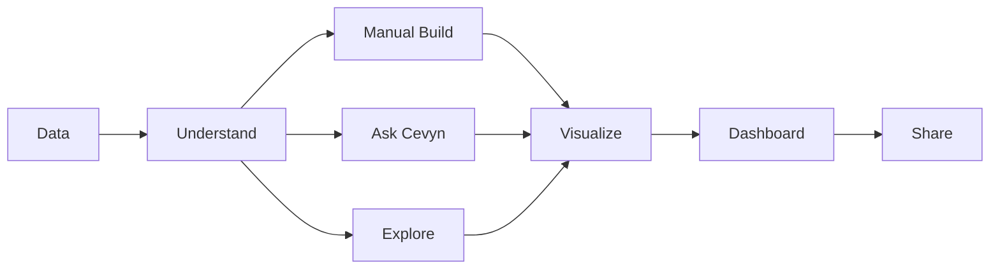

# Cevyn – Product Vision

## 1. Vision

Cevyn ist ein visual-first Visual-Analytics-Workspace.

Das Kernprodukt ist die verständliche, ausdrucksstarke und interaktive
Visualisierung von Daten. Cevyn nutzt Apache ECharts dafür tiefgehend,
ohne dessen Renderer-Modell zum Produktmodell zu machen.

Cevyn ist keine breite Data-/Analytics-Plattform, keine umfangreiche
ETL-Lösung und kein Fabric-Klon. Data Handling, AI und spätere
ML-Fähigkeiten dienen der visuellen Analyse und bleiben auf diesen
Kontext begrenzt.

Der Nutzer soll dafür möglichst wenig oder keinen Code schreiben
müssen.

Cevyn geht über einen isolierten Chart Builder hinaus, indem Charts zu
interaktiven Dashboards und geteilten Analyseergebnissen verbunden
werden.

## 2. Core Workflow

Der grundlegende Produktfluss ist:

```text
Data
→ Understand
→ Explore
→ Visualize
→ Dashboard
→ Share
```

Rohdaten müssen nicht bereits exakt die Struktur besitzen, die eine
Visualisierung benötigt. Cevyn bietet dafür gezieltes Profiling,
semantische Rollen, Aggregationen und leichte Transformationen, aber
keine allgemeine Datenintegrations- oder ETL-Umgebung.

## 3. Product Principles

### Visual First

Charts und Dashboards sind das Zentrum des Produkts. Datenverständnis,
Explore und AI führen in dieselbe Visualisierungsengine und dieselben
ChartSpecs.

### Progressive Complexity

Einfache Aufgaben sollen einfach bleiben.

Fortgeschrittene Optionen werden erst sichtbar, wenn sie benötigt
werden.

Dashboard, hochwertige Interaktion und geringe Komplexität haben
Vorrang vor einer möglichst breiten Feature-Sammlung.

### One Shared Data Model

Manuelles Bauen, AI Commands und Explore arbeiten auf denselben
Datasets, Fields, ChartSpecs, Dashboard-Objekten und Cevyn Actions.

Keine isolierten Datenmodelle pro Nutzungsmodus.

### Direct Manipulation

Wo sinnvoll, sollen Daten und Visualisierungen direkt manipuliert
werden können.

Beispiel:

```text
Field
→ Drag
→ Axis / Encoding
```

Grundregel:

```text
Drag für Beziehungen und Zuweisungen.
Controls für Werte und Einstellungen.
```

### Reusable Results

Ein einmal erzeugtes Calculated Field oder eine Metric soll in
verschiedenen Visualisierungen und Analysen wiederverwendbar sein.

### Data Remains Central

Design und Animation dürfen die Daten nicht überlagern.

Die visuelle Sprache unterstützt die Analyse und ist kein Selbstzweck.

## 4. Product Structure

Cevyn unterstützt drei komplementäre Nutzungsmodi:

- manuell bauen;
- Cevyn in natürlicher Sprache fragen;
- Explore für automatisch erzeugte Analysevorschläge nutzen.

Alle drei Modi münden in dieselbe Chart- und Dashboard-Engine.



Die Modi sind keine voneinander getrennten Anwendungen. Sie verwenden
einen gemeinsamen Project State, gemeinsame Actions und dieselben
ChartSpecs.

## 5. Visual Analytics Workspace

Visualize ist der zentrale Analyse- und Dashboard-Workspace.

Apache ECharts wird nicht nur als einfacher Chart-Renderer genutzt.
Encodings, Series, Interaktionen, Zoom, Selections und koordinierte
Dashboard-Zustände sollen seine Fähigkeiten gezielt ausschöpfen.

Die grundlegende Oberfläche besteht aus:

```text
Build Panel | Canvas | Inspector
```

### Build Panel

Das Build Panel beantwortet:

> Was möchte ich erstellen oder verwenden?

Langfristige Inhalte:

- Visualizations
- Dataset
- Fields
- Calculated Fields
- Controls
- Elements

### Canvas

Die Canvas ist der direkte Arbeitsbereich.

Langfristig kann sie enthalten:

- Charts
- KPI Cards
- Tables
- Filters
- Slicers
- Text
- Images
- weitere Dashboard Objects

Mehrere Objekte können später:

- hinzugefügt,
- selektiert,
- bewegt,
- resized,
- dupliziert,
- gelöscht

werden.

### Inspector

Der Inspector beantwortet:

> Wie ist das aktuell ausgewählte Objekt konfiguriert?

Für Charts:

```text
Data
Appearance
Interaction
```

## 6. Data Handling für Visual Analytics

Data Handling ist bewusst auf die Anforderungen visueller Analyse
begrenzt. Cevyn soll Daten verständlich und visualisierbar machen,
aber keine allgemeine ETL- oder Data-Engineering-Plattform werden.

### Data View

Tabellarische Ansicht des Datasets.

### Semantische Rollen und Typen

- Physical Types
- Semantic Types
- visuelle Rollen und Feldverwendung
- Type Override
- Field Metadata

### Deterministisches Profiling

Data Profiling wird zunächst deterministisch im Python-Backend
ausgeführt. AI kann Ergebnisse später priorisieren und erklären,
ersetzt aber nicht ihre Berechnung.

Beispiele:

- Row Count
- Missing Values
- Unique Values
- Min / Max
- Mean / Median
- Summary Statistics
- Distribution
- Category Frequency

### Datenqualität

- Missing Values
- Duplicates
- Invalid Values
- Type Conversion

### Begrenzte Operationen und Transformationen

- Filter
- Sort
- Group / Aggregate
- leichte Calculated Fields
- einfache Ableitungen für Encodings und Visualisierungen

### Calculated Fields

Calculated Fields erzeugen neue Werte auf Row-Ebene.

Beispiele:

```text
Revenue - Cost
→ Profit
```

```text
Home Goals + ":" + Away Goals
→ Result
```

```text
First Name + " " + Last Name
→ Full Name
```

Langfristig sollen mindestens folgende Kategorien unterstützt werden:

- Numeric
- Text
- Date & Time
- Conditional
- Type Conversion

Calculated Fields sollen intern als strukturierte Expression bzw. AST
repräsentiert werden. Ihr Scope bleibt auf leichte, für Visual Analytics
benötigte Transformationen begrenzt.

## 7. Canonical Data Use Case

Ein kanonischer Cevyn-Use-Case sind Fußball-Matchdaten.

Ausgangsdaten:

```text
Home Team
Away Team
Home Goals
Away Goals
Home xG
Away xG
Attendance
Referee
```

Ziel:

Häufigste Match-Ergebnisse visualisieren.

Workflow:

```text
Home Goals + ":" + Away Goals
        ↓
Calculated Field: Result
        ↓
Count by Result
        ↓
Sort descending
        ↓
Bar Chart
```

Beispiel:

```text
1:0    142
2:1    113
0:0     91
1:1     87
```

Dieser Use Case verdeutlicht ein zentrales Produktprinzip:

Rohdaten müssen nicht bereits die Struktur besitzen, die eine
Visualisierung benötigt.

## 8. Metrics

Calculated Fields und Metrics sind unterschiedliche Konzepte.

### Calculated Field

Berechnung auf Row-Ebene:

```text
Revenue - Cost
→ Profit
```

### Metric

Aggregation bzw. analytische Kennzahl:

```text
SUM Revenue
AVG Revenue
COUNT Result
COUNT DISTINCT Customer
Profit Margin
```

Metrics sollen langfristig in:

- Charts
- KPI Cards
- Tables
- Dashboards
- Explore-Ergebnisse

wiederverwendbar sein.

## 9. Visualizations

Aktueller Core:

- Scatter
- Line
- Bar
- Pie
- Donut

Langfristig mögliche Visualisierungen:

- Area
- Heatmap
- Boxplot
- Treemap
- Sunburst
- Sankey
- Radar
- Graph
- Parallel Coordinates
- Candlestick
- Maps

Zusätzlich native Dashboard Visuals:

- KPI
- Metric Card
- Comparison Card
- Progress
- Status
- Table
- Text
- Image
- Filters
- Date Range
- Numeric Range

Nicht die Anzahl der Charttypen ist das primäre Produktziel.

Ausdrucksstarke Chart-Konfiguration, Dashboard-Interaktion und geringe
Komplexität haben höhere Priorität als eine möglichst große
Chartbibliothek.

## 10. Dashboards

Cevyn soll interaktive Multi-Chart-Dashboards auf einer gemeinsamen
Canvas unterstützen.

Beispiel:

```text
Dashboard
├── Revenue KPI
├── Revenue Line Chart
├── Country Bar Chart
├── Customer Scatter
├── Country Filter
└── Date Filter
```

Langfristige Interaktionen:

- Filtering
- Cross Filtering
- Cross Highlighting
- Selection
- Drill-down
- Zoom
- Pan
- Tooltip
- Legend Interaction
- gemeinsame Filter und Dashboard Controls

## 11. AI Commands und Explore

### Ask Cevyn

AI Commands übersetzen natürliche Sprache in bestehende Cevyn Actions
und ChartSpecs. AI erzeugt niemals direkt ECharts-Code und umgeht nicht
das Cevyn Domain Model.

Beispiel:

> Show revenue by month and highlight the strongest decline.

Das Ergebnis besteht aus nachvollziehbaren, editierbaren Aktionen und
wird über dieselbe Chart Engine wie manuell erstellte Visualisierungen
gerendert.

### Explore

Explore ist ein zentrales Produktfeature für geführte visuelle Analyse:

```text
Python erzeugt Candidate Insights
→ AI priorisiert und erklärt
→ Cevyn visualisiert über dieselbe Chart Engine
```

Statistische Berechnungen, Profiling und Candidate Generation bleiben
deterministisch und nachvollziehbar. AI unterstützt Auswahl,
Orchestrierung und Erklärung.

### Machine Learning

ML bleibt eine langfristige Erweiterung von Visual Analytics. Mögliche
Ergebnisse wie Forecasts, Cluster oder Anomalien fließen in Charts und
Dashboards zurück. Cevyn wird kein eigenständiges ML-Studio.

## 12. Cevyn Share

Langfristige Output- und Sharing-Möglichkeiten:

### Save

Editierbares Cevyn-Projekt:

```text
sales-dashboard.cevyn
```

Die Datei speichert den Projektzustand und nicht lediglich ein
gerendertes Bild.

### Export

Mögliche Formate:

- PNG
- SVG
- PDF
- CSV
- Interactive HTML

### Publish

Langfristig:

- Share Links
- Published Dashboards
- Collaboration
- Permissions

## 13. Cevyn Project Files

Ein `.cevyn`-Projekt soll langfristig den Zustand eines Projekts
serialisieren.

Dazu können gehören:

- Project Metadata
- Datasets
- Calculated Fields
- leichte Transformationsdefinitionen
- Metrics
- ChartSpecs
- Chart Layouts
- Dashboard Objects
- Filters
- Interactions

Eine erste Version kann JSON-basiert sein.

Später kann `.cevyn` als Containerformat unter anderem JSON,
Parquet-Daten und Assets enthalten.

## 14. Long-Term Positioning

Cevyn entwickelt sich von einem Chart Builder zu einem visual-first
Visual-Analytics-Workspace.

Kurz:

```text
Data
→ Understand
→ Explore
→ Visualize
→ Dashboard
→ Share
```

Der Schwerpunkt liegt auf ausdrucksstarker Visualisierung,
hochwertiger Dashboard-Interaktion und geringer Komplexität. Cevyn
bleibt bewusst fokussierter als eine breite Data-Plattform, eine
umfangreiche ETL-Lösung oder ein Fabric-ähnliches System.
