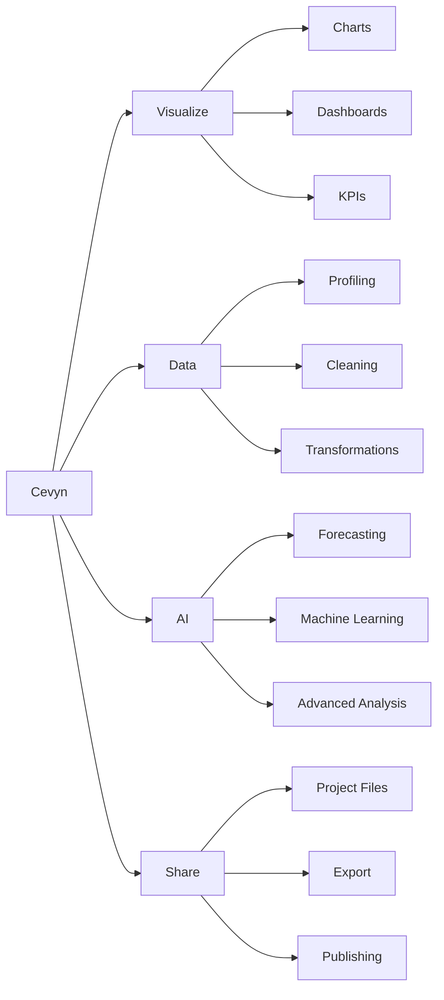

# Cevyn – Product Vision

## 1. Vision

Cevyn ist eine moderne visuelle Data-Analytics-Plattform.

Das langfristige Ziel ist, Rohdaten innerhalb eines zusammenhängenden
Workflows in verständliche Daten, Analysen, Visualisierungen,
Dashboards und Machine-Learning-Ergebnisse zu überführen.

Der Nutzer soll dafür möglichst wenig oder keinen Code schreiben
müssen.

Cevyn ist langfristig nicht nur ein Chart Builder.

Der Visualization Builder bildet den ersten produktiven Layer einer
größeren Analytics-Plattform.

## 2. Core Workflow

Der grundlegende Produktfluss ist:

```text
Import
→ Understand
→ Clean
→ Transform
→ Calculate
→ Analyze
→ Visualize
→ Build Dashboard
→ Save / Share
→ ML / AI
```

Rohdaten müssen nicht bereits exakt die Struktur besitzen, die für
eine Analyse oder Visualisierung benötigt wird.

Cevyn soll Nutzern ermöglichen, die benötigte analytische Struktur
visuell zu erzeugen.

## 3. Product Principles

### Visual First

Komplexe Datenoperationen sollen möglichst über verständliche visuelle
Interaktionen zugänglich sein.

### Progressive Complexity

Einfache Aufgaben sollen einfach bleiben.

Fortgeschrittene Optionen werden erst sichtbar, wenn sie benötigt
werden.

### One Shared Data Model

Data, Visualize und AI arbeiten auf denselben Datasets, Fields,
Calculated Fields, Metrics und Transformationsdefinitionen.

Keine isolierten Datenmodelle pro Workspace.

### Direct Manipulation

Wo sinnvoll, sollen Daten und Visualisierungen direkt manipuliert
werden können.

Beispiel:

```text
Field
→ Drag
→ Axis / Encoding
```

Grundregel:

```text
Drag für Beziehungen und Zuweisungen.
Controls für Werte und Einstellungen.
```

### Reusable Results

Ein einmal erzeugtes Calculated Field oder eine Metric soll in
verschiedenen Visualisierungen und Analysen wiederverwendbar sein.

### Data Remains Central

Design und Animation dürfen die Daten nicht überlagern.

Die visuelle Sprache unterstützt die Analyse und ist kein Selbstzweck.

## 4. Product Structure

Cevyn wird langfristig in Workspaces organisiert.



Die Workspaces sind keine voneinander getrennten Anwendungen.

Sie verwenden einen gemeinsamen Project State und eine gemeinsame
Data Engine.

## 5. Visualize Workspace

Visualize ist der visuelle Analyse- und Dashboard-Workspace.

Die grundlegende Oberfläche besteht aus:

```text
Build Panel | Canvas | Inspector
```

### Build Panel

Das Build Panel beantwortet:

> Was möchte ich erstellen oder verwenden?

Langfristige Inhalte:

- Visualizations
- Dataset
- Fields
- Calculated Fields
- Controls
- Elements

### Canvas

Die Canvas ist der direkte Arbeitsbereich.

Langfristig kann sie enthalten:

- Charts
- KPI Cards
- Tables
- Filters
- Slicers
- Text
- Images
- weitere Dashboard Objects

Mehrere Objekte können später:

- hinzugefügt,
- selektiert,
- bewegt,
- resized,
- dupliziert,
- gelöscht

werden.

### Inspector

Der Inspector beantwortet:

> Wie ist das aktuell ausgewählte Objekt konfiguriert?

Für Charts:

```text
Data
Appearance
Interaction
```

## 6. Cevyn Data

Cevyn Data ist der Workspace für Datenverständnis und
Datenvorbereitung.

Langfristige Fähigkeiten:

### Data View

Tabellarische Ansicht des Datasets.

### Schema

- Physical Types
- Semantic Types
- Type Override
- Rename
- Field Metadata

### Profiling

Beispiele:

- Row Count
- Missing Values
- Unique Values
- Min / Max
- Mean / Median
- Distribution
- Category Frequency

### Cleaning

Beispiele:

- Missing Values
- Duplicates
- Invalid Values
- Whitespace
- Replace Values
- Type Conversion

### Transformations

Beispiele:

- Filter
- Sort
- Calculated Fields
- Group / Aggregate
- Join
- Pivot
- Split Column
- Combine Columns

### Calculated Fields

Calculated Fields erzeugen neue Werte auf Row-Ebene.

Beispiele:

```text
Revenue - Cost
→ Profit
```

```text
Home Goals + ":" + Away Goals
→ Result
```

```text
First Name + " " + Last Name
→ Full Name
```

Langfristig sollen mindestens folgende Kategorien unterstützt werden:

- Numeric
- Text
- Date & Time
- Conditional
- Type Conversion

Calculated Fields sollen intern als strukturierte Expression bzw. AST
repräsentiert werden und nicht von einer bestimmten Execution Engine
abhängen.

## 7. Canonical Data Use Case

Ein kanonischer Cevyn-Use-Case sind Fußball-Matchdaten.

Ausgangsdaten:

```text
Home Team
Away Team
Home Goals
Away Goals
Home xG
Away xG
Attendance
Referee
```

Ziel:

Häufigste Match-Ergebnisse visualisieren.

Workflow:

```text
Home Goals + ":" + Away Goals
        ↓
Calculated Field: Result
        ↓
Count by Result
        ↓
Sort descending
        ↓
Bar Chart
```

Beispiel:

```text
1:0    142
2:1    113
0:0     91
1:1     87
```

Dieser Use Case verdeutlicht ein zentrales Produktprinzip:

Rohdaten müssen nicht bereits die Struktur besitzen, die eine
Visualisierung benötigt.

## 8. Metrics

Calculated Fields und Metrics sind unterschiedliche Konzepte.

### Calculated Field

Berechnung auf Row-Ebene:

```text
Revenue - Cost
→ Profit
```

### Metric

Aggregation bzw. analytische Kennzahl:

```text
SUM Revenue
AVG Revenue
COUNT Result
COUNT DISTINCT Customer
Profit Margin
```

Metrics sollen langfristig in:

- Charts
- KPI Cards
- Tables
- Dashboards
- AI Analyses

wiederverwendbar sein.

## 9. Visualizations

Aktueller Core:

- Scatter
- Line
- Bar

Langfristig mögliche Visualisierungen:

- Area
- Pie / Donut
- Heatmap
- Boxplot
- Treemap
- Sunburst
- Sankey
- Radar
- Graph
- Parallel Coordinates
- Candlestick
- Maps

Zusätzlich native Dashboard Visuals:

- KPI
- Metric Card
- Comparison Card
- Progress
- Status
- Table
- Text
- Image
- Filters
- Date Range
- Numeric Range

Nicht die Anzahl der Charttypen ist das primäre Produktziel.

Data Workflow, Berechnungen, Dashboards und Wiederverwendbarkeit haben
höhere Priorität als eine möglichst große Chartbibliothek.

## 10. Dashboards

Cevyn soll mehrere Visualisierungen auf einer Canvas unterstützen.

Beispiel:

```text
Dashboard
├── Revenue KPI
├── Revenue Line Chart
├── Country Bar Chart
├── Customer Scatter
├── Country Filter
└── Date Filter
```

Langfristige Interaktionen:

- Filtering
- Cross Filtering
- Selection
- Zoom
- Tooltip
- Legend Interaction
- Dashboard Controls

## 11. Cevyn AI

Cevyn AI erweitert die gemeinsame Data Engine um Machine Learning und
fortgeschrittene Analyse.

Geplante Bereiche:

- Forecasting
- Clustering
- Anomaly Detection
- Regression
- Classification
- Feature Importance

Machine-Learning-Ergebnisse sollen wieder in den normalen
Cevyn-Workflow zurückfließen können.

Beispiel:

```text
Customer Dataset
→ Clustering
→ cluster_id
→ Color Encoding im Scatter Plot
```

### AI Assistant

Langfristig kann ein AI Assistant Analysefragen unterstützen.

Beispiel:

> Why did revenue fall in August?

Grundprinzip:

Statistische Berechnungen und Datenoperationen werden von der Data
Engine ausgeführt.

Ein LLM kann Ergebnisse orchestrieren und erklären, soll aber nicht
die eigentliche analytische Berechnung ersetzen.

## 12. Cevyn Share

Langfristige Output- und Sharing-Möglichkeiten:

### Save

Editierbares Cevyn-Projekt:

```text
sales-dashboard.cevyn
```

Die Datei speichert den Projektzustand und nicht lediglich ein
gerendertes Bild.

### Export

Mögliche Formate:

- PNG
- SVG
- PDF
- CSV
- Interactive HTML

### Publish

Langfristig:

- Share Links
- Published Dashboards
- Collaboration
- Permissions

## 13. Cevyn Project Files

Ein `.cevyn`-Projekt soll langfristig den Zustand eines Projekts
serialisieren.

Dazu können gehören:

- Project Metadata
- Datasets
- Calculated Fields
- Transformations
- Metrics
- ChartSpecs
- Chart Layouts
- Dashboard Objects
- Filters
- Interactions

Eine erste Version kann JSON-basiert sein.

Später kann `.cevyn` als Containerformat unter anderem JSON,
Parquet-Daten und Assets enthalten.

## 14. Long-Term Positioning

Cevyn soll sich von einem Chart Builder zu einer visuellen
Analytics-Plattform entwickeln.

Kurz:

```text
Raw Data
→ Analysis
→ Visualizations
→ Dashboards
→ Models
```

ohne dass Nutzer für typische Workflows zwingend Python, SQL oder
eine proprietäre Formelsprache schreiben müssen.
