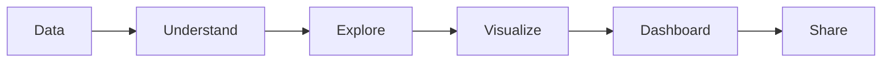

# Cevyn – Roadmap

## 1. Zweck

Diese Datei beschreibt den aktuellen Entwicklungsstand und die
nächsten Prioritäten.

Sie ist bewusst dynamischer als die übrige Dokumentation.

Status:

```text
Completed
Current
Next
Later
```

Nur tatsächlich implementierte und verifizierte Funktionalität darf
unter `Completed` stehen.

## 2. Current Product Stage

Cevyn befindet sich aktuell im Aufbau des Visualization Core.

Der bestehende Chart Builder soll zunächst stabil abgeschlossen und
anschließend zu einem interaktiven Multi-Chart-Dashboard ausgebaut
werden. Data Handling bleibt auf Visual Analytics begrenzt.

## 3. Completed

### Data Foundation

- CSV Upload
- Dataset State
- Field / Schema Grundlage
- grundlegende Type Detection
- Rows-Preview-API und DataTable-Komponente ohne App-Anbindung

### Visualization Core

- Scatter Chart
- Line Chart
- Bar Chart
- Pie Chart
- Donut Chart
- Apache ECharts Integration
- X/Y Encodings
- Scatter Size Encoding
- Scatter Color Encoding
- Line Series
- Bar Series
- Pie-/Donut-Series über einen gemeinsamen radialen Content-Builder
- gruppierte Line-/Bar-/Pie-/Donut-Aggregation über Polars im Backend
- Legend für diskrete Series, Scatter-Kategorien und radiale Kategorien
- Continuous Color Scale für numerische Scatter-Color-Encodings
- backend-aggregiertes numerisches Color-Encoding für Bar-Charts
- unabhängige Value- und Color-Aggregation für Bar-Charts
- Legend Interaction mit Multiple-, Single- und deaktivierter Auswahl
- formatierte Standard-Tooltips für Scatter, Line, Bar, Pie und Donut

### Inspector Foundation

- Inspector
- Data Tab
- Appearance Tab
- Interaction Tab
- grundlegende chart-spezifische Properties

### Reusable Controls

- ColorControl
- kompakte ColorControl-Variante
- GradientControl für kontinuierliche Farbverläufe
- ScrubbableNumber
- grundlegende Inspector Controls

### Architecture Foundation

- ChartSpec-orientierte Chart-Konfiguration
- ChartInstance-Grundlage
- Trennung von Chart Spec und Layout als Zielstruktur
- modularer ECharts-Adapter mit Registry für charttypspezifischen Content

## 4. Current

Aktueller Fokus:

### Visualization Completion

- Inspector-Polish für Scatter, Line, Bar, Pie und Donut

### Build Panel Cleanup

Zielstruktur:

```text
Visualizations

Dataset

Fields

+ Calculated Field
```

Ziele:

- Visualizations prominent und direkt erreichbar
- kompakte Dataset-Darstellung nach Upload
- skalierbare Field List
- Semantic Type Icons
- Calculated Field Entry Point

Priorität nach Abschluss des aktuellen Slices:

1. Multi-Chart Canvas;
2. Dashboard Objects und Interaktion;
3. Understand und fokussiertes Data Handling;
4. Project Persistence und Share;
5. Ask Cevyn und Explore.

## 5. Next – Visual Analytics Workspace Shell

Nach Abschluss des aktuellen Visualization Core:

```text
AppShell
├── TopBar
└── VisualAnalyticsWorkspace
    ├── Build Panel
    ├── Canvas
    └── Inspector
```

Manual Build bleibt der erste vollständig nutzbare Modus. Understand,
Ask Cevyn und Explore werden später als integrierte Modi oder
fokussierte Ansichten angebunden, nicht als separate Produktsuite.

## 6. Next – Multi-Chart Canvas

Ziel:

Mehrere Dashboard Objects auf einer Canvas.

MVP-Funktionen:

- Add
- Select
- Move
- Resize
- Duplicate
- Delete

Grundmodell:

```text
ChartInstance
├── id
├── type
├── spec
└── layout
```

Noch nicht Teil des ersten Multi-Chart-MVP:

- Smart Guides
- Groups
- Multi Select
- Layers Panel
- komplexes Snapping

## 7. Next – Dashboard Objects und Interaktion

Nach bzw. gemeinsam mit Multi-Chart:

- KPI Card
- Text
- Filter
- grundlegende Dashboard Controls
- gemeinsame Filter
- Linked Visualizations
- Selection und Selection Propagation
- Cross Filtering
- Cross Highlighting
- Zoom und Pan
- Drill-down

Später innerhalb dieses Bereichs:

- Date Range
- Numeric Range
- Slicer
- Image
- Comparison Card
- Progress
- Status

## 8. Next – Understand / Data Handling MVP

### Deterministic Profiling

Zunächst im Python-Backend:

- Summary Statistics
- Missing Values
- Duplicates
- Category Frequency
- Distribution

### Type Handling

- bessere Semantic Type Detection
- Type Override
- semantische Rollen für Visualisierungen

### Light Data Operations

- Filter
- Sort
- Group / Aggregate
- leichte Ableitungen für Encodings

### Calculated Fields

Erste Operationen:

```text
Numeric: + - × ÷
Text: Combine Fields
```

Canonical Use Case:

```text
Home Goals + ":" + Away Goals
→ Result
```

Calculated Fields erscheinen anschließend als normale Fields:

```text
ƒx Result
```

## 9. Next – Project Persistence

Sobald der zentrale Project State ausreichend stabil ist:

```text
serializeProject()
deserializeProject()
```

Persistence Targets können darauf aufbauen:

```text
Local Storage
.cevyn File
Backend Persistence
```

### `.cevyn` MVP

Erste Version:

- JSON-basiert
- eigene `.cevyn` Dateiendung
- Format Identifier
- Version
- Project State
- Dashboard State
- relevante Dataset-Daten

Beispiel:

```json
{
  "format": "cevyn",
  "version": 1
}
```

Ziel:

```text
Save Project
Open Project
```

## 10. Later – Data Scale and Visual Query Engine

Wenn aktuelle Datenhaltung zum Bottleneck wird:

- DuckDB
- größere Datasets
- performantere aggregierte Visual Queries
- Sampling und Caching
- skalierbares deterministisches Profiling
- Candidate Generation für Explore
- Parquet

Keine vorschnelle Migration nur aus Architekturgründen.

## 11. Later – Advanced Visualizations

Nach einem vollständigen End-to-End-Workflow:

- Heatmap
- Boxplot

Danach bei Bedarf:

- Treemap
- Sunburst
- Sankey
- Radar
- Graph
- Parallel Coordinates
- Candlestick
- Maps

Neue Charttypen haben geringere Priorität als ein vollständiger
Data-to-Dashboard-Workflow.

## 12. Later – Ask Cevyn und Explore

### Action Foundation

- zentrale Registry für validierbare Cevyn Actions
- Actions für ChartSpecs, Dashboard State und gemeinsame Filter
- deterministische Ausführung und nachvollziehbare Änderungen

### Ask Cevyn

```text
Natural Language
→ validated Cevyn Actions
→ ChartSpec / Dashboard State
```

AI erzeugt keinen direkten ECharts-Code.

### Explore

```text
Python Candidate Generation
→ Candidate Insights
→ AI Ranking / Explanation
→ Cevyn Actions
→ ChartSpec
```

### Machine Learning

Forecasts, Cluster oder Anomalien bleiben spätere Erweiterungen von
Visual Analytics und werden kein eigenständiges ML-Studio.

## 13. Later – Share

### Export

- PNG
- SVG
- PDF
- CSV
- Interactive HTML

### Publish

- Share Link
- Published Dashboard

### Collaboration

Später:

- Accounts
- Organizations
- Permissions
- Comments
- Version History

## 14. Long-Term Flow

Der langfristige vollständige Workflow:



## 15. MVP Definition

Der erste echte Cevyn-MVP soll mindestens folgenden Workflow
ermöglichen:

```text
Upload Dataset
→ Understand Data
→ Review Types and Profile
→ Filter / Aggregate
→ Create Visualizations
→ Create Multiple Visualizations
→ Arrange Dashboard
→ Use Shared Filters and Selection
→ Save Project
→ Reopen Project
```

Das Ziel ist nicht maximale Feature-Anzahl.

Das Ziel ist ein vollständiger, verständlicher und wiederholbarer
Visual-Analytics-Workflow.
