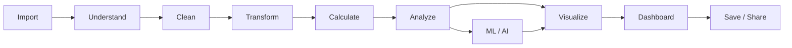

# Cevyn – Roadmap

## 1. Zweck

Diese Datei beschreibt den aktuellen Entwicklungsstand und die
nächsten Prioritäten.

Sie ist bewusst dynamischer als die übrige Dokumentation.

Status:

```text
Completed
Current
Next
Later
```

Nur tatsächlich implementierte und verifizierte Funktionalität darf
unter `Completed` stehen.

## 2. Current Product Stage

Cevyn befindet sich aktuell im Aufbau des Visualization Core.

Der bestehende Chart Builder soll zunächst stabil abgeschlossen und
anschließend um Data Workflow, Multi-Chart Dashboards und Persistence
erweitert werden.

## 3. Completed

### Data Foundation

- CSV Upload
- Dataset State
- Field / Schema Grundlage
- grundlegende Type Detection
- Rows-Preview-API und DataTable-Komponente ohne App-Anbindung

### Visualization Core

- Scatter Chart
- Line Chart
- Bar Chart
- Apache ECharts Integration
- X/Y Encodings
- Scatter Size Encoding
- Scatter Color Encoding
- Line Series
- Bar Series
- gruppierte Line-/Bar-Aggregation über Polars im Backend
- Legend für diskrete Line-/Bar-Series und Scatter-Kategorien
- Continuous Color Scale für numerische Scatter-Color-Encodings
- backend-aggregiertes numerisches Color-Encoding für Bar-Charts
- unabhängige Value- und Color-Aggregation für Bar-Charts
- Legend Interaction mit Multiple-, Single- und deaktivierter Auswahl
- formatierte Standard-Tooltips für Scatter, Line und Bar

### Inspector Foundation

- Inspector
- Data Tab
- Appearance Tab
- Interaction Tab
- grundlegende chart-spezifische Properties

### Reusable Controls

- ColorControl
- kompakte ColorControl-Variante
- GradientControl für kontinuierliche Farbverläufe
- ScrubbableNumber
- grundlegende Inspector Controls

### Architecture Foundation

- ChartSpec-orientierte Chart-Konfiguration
- ChartInstance-Grundlage
- Trennung von Chart Spec und Layout als Zielstruktur
- modularer ECharts-Adapter mit Registry für charttypspezifischen Content

## 4. Current

Aktueller Fokus:

### Visualization Completion

- Inspector-Polish für Scatter, Line und Bar

### Build Panel Cleanup

Zielstruktur:

```text
Visualizations

Dataset

Fields

+ Calculated Field
```

Ziele:

- Visualizations prominent und direkt erreichbar
- kompakte Dataset-Darstellung nach Upload
- skalierbare Field List
- Semantic Type Icons
- Calculated Field Entry Point

## 5. Next – App Shell

Nach Abschluss des aktuellen Visualization Core:

```text
AppShell
├── TopBar
├── NavigationRail
└── ActiveWorkspace
```

Erste Workspaces:

```text
Visualize
Data
```

Visualize übernimmt:

```text
Build Panel
Canvas
Inspector
```

Data bindet zunächst die vorhandene DataTable-Komponente und die
Rows-Preview-API als erreichbare Data View ein.

AI und Share werden architektonisch berücksichtigt, müssen aber noch
nicht vollständig implementiert werden.

## 6. Next – Cevyn Data MVP

### Type Handling

- bessere Semantic Type Detection
- Type Override

### Calculated Fields

Erste Operationen:

```text
Numeric:
+ - × ÷

Text:
Combine Fields
```

Canonical Use Case:

```text
Home Goals + ":" + Away Goals
→ Result
```

Calculated Fields erscheinen anschließend als normale Fields:

```text
ƒx Result
```

### Basic Data Operations

- Filter
- Sort
- einfache Data Profiling Informationen

Später:

- Missing Values
- Duplicates
- Replace Values
- Split Column
- Join
- Pivot

## 7. Next – Multi-Chart Canvas

Ziel:

Mehrere Dashboard Objects auf einer Canvas.

MVP-Funktionen:

- Add
- Select
- Move
- Resize
- Duplicate
- Delete

Grundmodell:

```text
ChartInstance
├── id
├── type
├── spec
└── layout
```

Noch nicht Teil des ersten Multi-Chart-MVP:

- Smart Guides
- Groups
- Multi Select
- Layers Panel
- komplexes Snapping
- Cross Filtering

## 8. Next – Dashboard Objects

Nach bzw. gemeinsam mit Multi-Chart:

- KPI Card
- Text
- Filter
- grundlegende Dashboard Controls

Später:

- Date Range
- Numeric Range
- Slicer
- Image
- Comparison Card
- Progress
- Status

## 9. Next – Project Persistence

Sobald der zentrale Project State ausreichend stabil ist:

```text
serializeProject()
deserializeProject()
```

Persistence Targets können darauf aufbauen:

```text
Local Storage
.cevyn File
Backend Persistence
```

### `.cevyn` MVP

Erste Version:

- JSON-basiert
- eigene `.cevyn` Dateiendung
- Format Identifier
- Version
- Project State
- Dashboard State
- relevante Dataset-Daten

Beispiel:

```json
{
  "format": "cevyn",
  "version": 1
}
```

Ziel:

```text
Save Project
Open Project
```

## 10. Later – Data Engine

Wenn aktuelle Datenhaltung zum Bottleneck wird:

- DuckDB
- größere Datasets
- weitere serverseitige Analysen und Transformationen
- Joins
- Pivot
- komplexere Transformationspipelines
- Parquet

Keine vorschnelle Migration nur aus Architekturgründen.

## 11. Later – Advanced Visualizations

Nach einem vollständigen End-to-End-Workflow:

- Pie / Donut
- Heatmap
- Boxplot

Danach bei Bedarf:

- Treemap
- Sunburst
- Sankey
- Radar
- Graph
- Parallel Coordinates
- Candlestick
- Maps

Neue Charttypen haben geringere Priorität als ein vollständiger
Data-to-Dashboard-Workflow.

## 12. Later – Dashboard Interaction

- Cross Filtering
- Cross Highlighting
- Dashboard-wide Filters
- Selection Propagation
- Linked Visualizations

## 13. Later – Cevyn AI

Erste mögliche Module:

- Forecasting
- Clustering
- Anomaly Detection
- Regression
- Classification
- Feature Importance

Machine-Learning-Ergebnisse sollen wieder als Daten in den normalen
Cevyn-Workflow zurückfließen können.

Beispiel:

```text
Clustering
→ cluster_id
→ Scatter Color
```

## 14. Later – Share

### Export

- PNG
- SVG
- PDF
- CSV
- Interactive HTML

### Publish

- Share Link
- Published Dashboard

### Collaboration

Später:

- Accounts
- Organizations
- Permissions
- Comments
- Version History

## 15. Long-Term Flow

Der langfristige vollständige Workflow:



## 16. MVP Definition

Der erste echte Cevyn-MVP soll mindestens folgenden Workflow
ermöglichen:

```text
Upload Dataset
→ Inspect Data
→ Correct Types
→ Create Calculated Fields
→ Filter / Aggregate
→ Create Visualizations
→ Create Multiple Visualizations
→ Arrange Dashboard
→ Save Project
→ Reopen Project
```

Das Ziel ist nicht maximale Feature-Anzahl.

Das Ziel ist ein vollständiger, verständlicher und wiederholbarer
End-to-End-Workflow.
