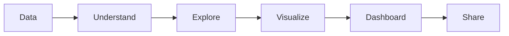

# Cevyn – Roadmap

## 1. Zweck

Diese Datei beschreibt den aktuellen Entwicklungsstand und die
nächsten Prioritäten.

Sie ist bewusst dynamischer als die übrige Dokumentation.

Status:

```text
Completed
Current
Next
Later
```

Nur tatsächlich implementierte und verifizierte Funktionalität darf
unter `Completed` stehen.

## 2. Current Product Stage

Cevyn befindet sich aktuell im Aufbau des Visualization Core.

Die Canvas unterstützt bereits mehrere Charts mit Layout und eine erste
Dashboard-Interaktion über globales Cross-Highlighting. Als Nächstes
wird sie zu einem interaktiven Multi-Chart-Dashboard ausgebaut. Data
Handling bleibt auf Visual Analytics begrenzt.

## 3. Completed

### Data Foundation

- CSV Upload
- Dataset State
- Field / Schema Grundlage
- grundlegende Type Detection
- Rows-Preview-API und DataTable-Komponente ohne App-Anbindung

### Visualization Core

- Scatter Chart
- Line Chart
- Bar Chart
- Pie Chart
- Donut Chart
- Apache ECharts Integration
- X/Y Encodings
- Scatter Size Encoding
- Scatter Color Encoding
- Line Series
- Bar Series
- Pie-/Donut-Series über einen gemeinsamen radialen Content-Builder
- gruppierte Line-/Bar-/Pie-/Donut-Aggregation über Polars im Backend
- Legend für diskrete Series, Scatter-Kategorien und radiale Kategorien
- Continuous Color Scale für numerische Scatter-Color-Encodings
- backend-aggregiertes numerisches Color-Encoding für Bar-Charts
- unabhängige Value- und Color-Aggregation für Bar-Charts
- Legend Interaction mit Multiple-, Single- und deaktivierter Auswahl
- formatierte Standard-Tooltips für Scatter, Line, Bar, Pie und Donut
- Achsen-Formatierung: Titelfarbe, -größe und -gewicht, Tick Count
  (Auto/Custom) und Label-Rotation für X und Y

### Inspector Foundation

- Inspector
- Data Tab
- Appearance Tab
- Interaction Tab
- grundlegende chart-spezifische Properties

### Reusable Controls

- ColorControl
- kompakte ColorControl-Variante
- GradientControl für kontinuierliche Farbverläufe
- ScrubbableNumber
- FontWeightControl
- RotationDial mit Shift-Snapping und präziser Zahleneingabe
- zentrale Liquid-Glass-Surfaces (`.glass` in drei Stufen) mit
  Lichtkante, Ambient-Hintergrund und Reduced-Transparency-Fallback
- lokal eingebundene Schrift Inter Variable
- grundlegende Inspector Controls

### Multi-Chart Canvas MVP

- mehrere Charts gleichzeitig auf der Canvas
- Add per Klick oder Drag aus dem Chart Picker
- Select per Klick, Deselect per Klick auf freie Canvas-Fläche
- Move über eine obere Griffleiste
- Resize über alle Kanten und Ecken
- Einrasten im 24-spaltigen Grid mit Live-Vorschau
- Duplicate und Delete für den selektierten Chart
- Charttyp-Wechsel im Inspector
- Field-Drop auf die Achsen eines beliebigen Charts
- neuer Chart wird ins Bild gescrollt und kurz hervorgehoben
- Tooltips werden nicht mehr vom Chart-Rahmen abgeschnitten

### Cross-Highlighting MVP

- globale, feldbasierte Datenauswahl (`selection`) im Workspace State
- Selection per Klick auf Kategorien in Line, Bar, Pie und Donut
- Selection per Klick auf Scatter-Punkte mit kategorialem Color-Feld
- erneuter Klick oder Klick auf leere Chart-Fläche hebt die Auswahl auf
- alle Charts heben den Anteil der ausgewählten Zeilen hervor, auch wenn
  sie das Selection-Feld nicht selbst codieren
- Line und Bar: abgeblendete Basis mit überlagerter Highlight-Serie aus
  einer gefilterten Backend-Query
- Pie und Donut: Anzeige der gefilterten Verteilung mit stabilen Farben
- Scatter: Abblenden nicht passender Zeilen im Frontend
- Tooltip benennt die ausgewählte Kategorie, ohne Dopplung im
  Quell-Chart
- Backend-Chart-Query mit `filters`

### Brush Selection

- Selection als Liste von Werte- und Bereichsfiltern
- Rechteck-Brush im Scatter, immer aktiv; Klick und Mausrad-Zoom bleiben
  erhalten
- Brush erzeugt Bereichsfilter auf X und Y, alle Charts heben den Anteil
  der Zeilen im Rechteck hervor
- Rechteck wird aus der Selection gezeichnet und verschwindet, wenn die
  Selection gelöscht wird oder aus einem anderen Chart stammt
- Rechteck in Akzentfarbe, ohne zusätzliches Abblenden durch ECharts
- Backend-Bereichsfilter für numerische Felder

### Canvas Container und Direct Editing

- Chart-Container im Domain Model (`ChartInstance.container`), getrennt
  von der `ChartSpec`
- Container-Widget im Inspector: Background (Glass, Surface, None,
  eigene Farbe), Padding, Radius
- Glass als Default-Container; Hover- und Auswahl-Ring innen, auch bei
  dicht platzierten Charts sichtbar
- Charttitel als HTML-Header statt ECharts-Titel, mit Ausrichtung
  Start/Mitte/Ende
- Inline-Editing des Titels direkt im Chart
- Tastaturbedienung: Move, Resize, Delete, Duplicate, Escape
- nach dem Löschen wird der nächste Chart ausgewählt und fokussiert,
  sonst die leere Canvas
- wiederverwendbare Controls `AlignmentControl` und `EditableText`,
  `ColorControl` mit eigenen Presets

### Inline-Editing der Achsentitel

- X- und Y-Achsentitel direkt im Chart bearbeitbar; ECharts rendert die
  Titel weiter
- Adapter übersetzt Klick und Hover auf den Titel in ein Domain-Event
  mit Achse und Bounding Box (`AxisTitleEdit`)
- Input liegt über dem Titel, der Original-Titel wird währenddessen
  ausgeblendet; Y-Input wächst nach innen in den Plot
- Placeholder ist der Feldname; leerer Titel bedeutet automatischer
  Titel
- Hover-Fläche und Text-Cursor wie beim Charttitel
- Edit-Hälfte von `EditableText` als `InlineTextInput` herausgezogen;
  Pointer-Down außerhalb übernimmt den Wert, auch wenn ECharts (Brush)
  das Default-Verhalten unterdrückt

### Workspace Panels

- Panel-Header als einzeilige Icon-Label-Zeile statt Eyebrow und Titel
- Canvas ohne Titel; Header dient als Toolbar
- Build Panel und Inspector unabhängig einklappbar, eingeklappt als
  schmale Icon-Leiste, Breite animiert
- Shortcuts Cmd/Ctrl + B und Cmd/Ctrl + I

### Undo/Redo und Command-Registry

- History um den `workspaceReducer` mit `past`, `present` und `future`,
  begrenzt auf 100 Schritte
- nur Dokument-Änderungen sind undo-fähig; Chart-Auswahl und
  Datenauswahl nicht
- kontinuierliche Änderungen (Scrubbing, Slider, Farbpicker,
  Pfeil-Nudges) werden per Coalesce-Key und Zeitfenster zu einem
  Schritt zusammengefasst
- zentrale Command-Registry speist Shortcuts und Buttons aus derselben
  Befehlsliste; ein globaler Listener, keine Shortcuts in Textfeldern
- Undo/Redo im Canvas-Header, Cmd/Ctrl + Z, Cmd/Ctrl + Shift + Z und
  Cmd/Ctrl + Y
- Duplicate und Delete als Aktionsleiste am ausgewählten Chart statt im
  Canvas-Header

### Architecture Foundation

- ChartSpec-orientierte Chart-Konfiguration
- ChartInstance mit getrennter Spec und Layout
- Workspace State mit typisierten, serialisierbaren Workspace Actions
  und reinem Reducer
- Ableitung der Backend-Chart-Query aus der ChartInstance
- typisierte Drag Payloads und Drop Targets
- modularer ECharts-Adapter mit Registry für charttypspezifischen Content

## 4. Current

Aktueller Fokus:

### Visualization Completion

- Inspector-Polish für Scatter, Line, Bar, Pie und Donut

### Build Panel Cleanup

Zielstruktur:

```text
Visualizations

Dataset

Fields

+ Calculated Field
```

Ziele:

- Visualizations prominent und direkt erreichbar
- kompakte Dataset-Darstellung nach Upload
- skalierbare Field List
- Semantic Type Icons
- Calculated Field Entry Point

Priorität nach Abschluss des Slices Undo/Redo und Command-Registry:

1. Canvas-/Objektarchitektur und Workspace UX:
   - als Nächstes: `DashboardSpec` mit Dashboard-Name im Canvas-Header
     und kontextsensitivem Inspector (Chart oder Dashboard),
     Dashboard-/Layout-Einstellungen;
   - Grundlage für weitere Objekte wie Text, KPI und Table;
   - Idee zur Neubewertung: Achsentitel wie den Charttitel als HTML im
     `ChartItem` rendern statt über ECharts (einfacheres Inline-Editing,
     dafür Positionierung am Grid und Bild-Export selbst lösen);
2. Data Profiling: Schema, Semantic Roles, Summary Statistics, Missing
   Values, Cardinality;
3. Build Panel mit dem Profiling verbinden;
4. Visualization Depth: Drill-down, Reference Lines, Zoom/Pan, Advanced
   Tooltips, weitere Encodings.

Danach folgen Project Persistence und Share sowie Ask Cevyn und
Explore.

## 5. Next – Visual Analytics Workspace Shell

Nach Abschluss des aktuellen Visualization Core:

```text
AppShell
├── TopBar
└── VisualAnalyticsWorkspace
    ├── Build Panel
    ├── Canvas
    └── Inspector
```

Manual Build bleibt der erste vollständig nutzbare Modus. Understand,
Ask Cevyn und Explore werden später als integrierte Modi oder
fokussierte Ansichten angebunden, nicht als separate Produktsuite.

## 6. Later – Multi-Chart Canvas Ausbau

Das Multi-Chart Canvas MVP ist abgeschlossen (siehe Completed).

Mögliche Erweiterungen:

- Kollisionsauflösung bzw. Verdrängen überlappender Charts
- Charttyp per Drop auf einen bestehenden Chart ersetzen
- Smart Guides
- Groups
- Multi Select
- Layers Panel
- weitere Container-Overrides: Rahmenfarbe, Shadow, Z-Order

## 7. Next – Dashboard Objects und Interaktion

Nach bzw. gemeinsam mit Multi-Chart:

- KPI Card
- Text
- Filter
- grundlegende Dashboard Controls
- gemeinsame Filter
- Linked Visualizations
- Selection und Selection Propagation (Klick-Selection implementiert,
  siehe Cross-Highlighting MVP)
- Brush Selection und Range-Selection (Scatter implementiert, Line und
  Bar offen)
- Mehrfachauswahl
- Cross Filtering (Backend-Filter vorhanden, Modus fehlt noch)
- Cross Highlighting (MVP implementiert)
- Zoom und Pan
- Drill-down

Später innerhalb dieses Bereichs:

- Date Range
- Numeric Range
- Slicer
- Image
- Comparison Card
- Progress
- Status

## 8. Next – Understand / Data Handling MVP

### Deterministic Profiling

Zunächst im Python-Backend:

- Summary Statistics
- Missing Values
- Duplicates
- Category Frequency
- Distribution

### Type Handling

- bessere Semantic Type Detection
- Type Override
- semantische Rollen für Visualisierungen

### Light Data Operations

- Filter
- Sort
- Group / Aggregate
- leichte Ableitungen für Encodings

### Calculated Fields

Erste Operationen:

```text
Numeric: + - × ÷
Text: Combine Fields
```

Canonical Use Case:

```text
Home Goals + ":" + Away Goals
→ Result
```

Calculated Fields erscheinen anschließend als normale Fields:

```text
ƒx Result
```

## 9. Next – Project Persistence

Sobald der zentrale Project State ausreichend stabil ist:

```text
serializeProject()
deserializeProject()
```

Persistence Targets können darauf aufbauen:

```text
Local Storage
.cevyn File
Backend Persistence
```

### `.cevyn` MVP

Erste Version:

- JSON-basiert
- eigene `.cevyn` Dateiendung
- Format Identifier
- Version
- Project State
- Dashboard State
- relevante Dataset-Daten

Beispiel:

```json
{
  "format": "cevyn",
  "version": 1
}
```

Ziel:

```text
Save Project
Open Project
```

## 10. Later – Data Scale and Visual Query Engine

Wenn aktuelle Datenhaltung zum Bottleneck wird:

- DuckDB
- größere Datasets
- performantere aggregierte Visual Queries
- Sampling und Caching
- skalierbares deterministisches Profiling
- Candidate Generation für Explore
- Parquet

Keine vorschnelle Migration nur aus Architekturgründen.

## 11. Later – Advanced Visualizations

Nach einem vollständigen End-to-End-Workflow:

- Heatmap
- Boxplot

Danach bei Bedarf:

- Treemap
- Sunburst
- Sankey
- Radar
- Graph
- Parallel Coordinates
- Candlestick
- Maps

Neue Charttypen haben geringere Priorität als ein vollständiger
Data-to-Dashboard-Workflow.

## 12. Later – Ask Cevyn und Explore

### Action Foundation

- zentrale Registry für validierbare Cevyn Actions
- Actions für ChartSpecs, Dashboard State und gemeinsame Filter
- deterministische Ausführung und nachvollziehbare Änderungen

### Ask Cevyn

```text
Natural Language
→ validated Cevyn Actions
→ ChartSpec / Dashboard State
```

AI erzeugt keinen direkten ECharts-Code.

### Explore

```text
Python Candidate Generation
→ Candidate Insights
→ AI Ranking / Explanation
→ Cevyn Actions
→ ChartSpec
```

### Machine Learning

Forecasts, Cluster oder Anomalien bleiben spätere Erweiterungen von
Visual Analytics und werden kein eigenständiges ML-Studio.

## 13. Later – Share

### Export

- PNG
- SVG
- PDF
- CSV
- Interactive HTML

### Publish

- Share Link
- Published Dashboard

### Collaboration

Später:

- Accounts
- Organizations
- Permissions
- Comments
- Version History

## 14. Long-Term Flow

Der langfristige vollständige Workflow:


```mermaid
flowchart LR
    Data[Data]
    Understand[Understand]
    Explore[Explore]
    Visualize[Visualize]
    Dashboard[Dashboard]
    Share[Share]

    Data --> Understand
    Understand --> Explore
    Explore --> Visualize
    Visualize --> Dashboard
    Dashboard --> Share
```

## 15. MVP Definition

Der erste echte Cevyn-MVP soll mindestens folgenden Workflow
ermöglichen:

```text
Upload Dataset
→ Understand Data
→ Review Types and Profile
→ Filter / Aggregate
→ Create Visualizations
→ Create Multiple Visualizations
→ Arrange Dashboard
→ Use Shared Filters and Selection
→ Save Project
→ Reopen Project
```

Das Ziel ist nicht maximale Feature-Anzahl.

Das Ziel ist ein vollständiger, verständlicher und wiederholbarer
Visual-Analytics-Workflow.

## 16. Known Technical Debt

Bekannte offene Punkte, die nicht Teil eines abgeschlossenen Slices
waren:

- `tsconfig.app.json` aktiviert keinen `strict`-Mode, Null-Checks werden
  daher nicht erzwungen.
- `npm run lint` meldet bestehende Fehler in `Popover`,
  `ScrubbableNumber`, `Slider` und `useChartQuery`.
- Scatter rendert nur die ersten 100 Zeilen, die das Frontend über die
  Rows-API lädt.
- Encodings speichern Kopien von `DataField` statt Referenzen auf Fields.
- `DataTable` nutzt noch den alten Surface-Stil statt `.glass`.
- In Safari kann die gesamte App horizontal scrollen, wenn die Inhalte
  breiter als das Fenster werden. Die Ursache ist noch nicht geklärt.
- Neue Charts werden beim Mount ins Bild gescrollt. Beim späteren Laden
  eines Projekts muss dieses Verhalten auf neu hinzugefügte Charts
  begrenzt werden.
- Selection-Werte werden als Strings verglichen. Boolean-Felder
  (`True` in Python gegenüber `true` in Polars), Float-Formatierung und
  leere Kategorien (`''`, `(empty)`, `No category`) treffen daher nicht
  in allen Charts einheitlich.
- Die Selection unterstützt nur einen Wert; es gibt keine
  Mehrfachauswahl.
- `createEChartOption` hat acht positionale Parameter und sollte auf ein
  Params-Objekt umgestellt werden.
- Die Grid-Abstände des Plots stehen doppelt in `createEChartOption`
  und als `--chart-grid-*` in `ChartItem.css` (für die Achsen-Drop-Zones).
- Ein späterer PNG-/SVG-Export über ECharts enthält den HTML-Titel und
  den Container nicht und muss beides selbst zusammensetzen.
- Ein ausgewählter Chart fokussiert sich selbst. Beim späteren Laden
  eines Projekts darf das nicht ungewollt den Fokus verschieben.
