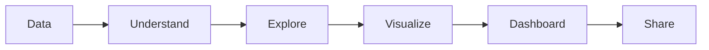

# Cevyn – Roadmap

## 1. Zweck

Diese Datei beschreibt den aktuellen Entwicklungsstand und die
nächsten Prioritäten.

Sie ist bewusst dynamischer als die übrige Dokumentation.

Status:

```text
Completed
Current
Next
Later
```

Nur tatsächlich implementierte und verifizierte Funktionalität darf
unter `Completed` stehen.

## 2. Current Product Stage

Visualization Core, Multi-Chart Canvas, Build Panel und Inspector sind
in einem ersten vollständigen Stand. Der nächste größere Meilenstein
ist der Data-Bereich: Cevyn soll einen geladenen Datensatz nicht nur
darstellen, sondern deterministisch verstehen.

Data Handling bleibt dabei auf Visual Analytics begrenzt und wird kein
ETL- oder Data-Engineering-Workspace.

## 3. Completed

### Data Foundation

- CSV Upload
- Dataset State
- Field / Schema Grundlage
- grundlegende Type Detection
- Rows-Preview-API und DataTable-Komponente

### Visualization Core

- Scatter Chart
- Line Chart
- Bar Chart
- Pie Chart
- Donut Chart
- Apache ECharts Integration
- X/Y Encodings
- Scatter Size Encoding
- Scatter Color Encoding
- Line Series
- Bar Series
- Pie-/Donut-Series über einen gemeinsamen radialen Content-Builder
- gruppierte Line-/Bar-/Pie-/Donut-Aggregation über Polars im Backend
- Legend für diskrete Series, Scatter-Kategorien und radiale Kategorien
- Continuous Color Scale für numerische Scatter-Color-Encodings
- backend-aggregiertes numerisches Color-Encoding für Bar-Charts
- unabhängige Value- und Color-Aggregation für Bar-Charts
- Legend Interaction mit Multiple-, Single- und deaktivierter Auswahl
- formatierte Standard-Tooltips für Scatter, Line, Bar, Pie und Donut
- Achsen-Formatierung: Titelfarbe, -größe und -gewicht, Tick Count
  (Auto/Custom) und Label-Rotation für X und Y

### Inspector Foundation

- Inspector
- Data Tab
- Appearance Tab
- Interaction Tab
- grundlegende chart-spezifische Properties

### Reusable Controls

- ColorControl
- kompakte ColorControl-Variante
- GradientControl für kontinuierliche Farbverläufe
- ScrubbableNumber
- FontWeightControl
- RotationDial mit Shift-Snapping und präziser Zahleneingabe
- zentrale Liquid-Glass-Surfaces (`.glass` in drei Stufen) mit
  Lichtkante, Ambient-Hintergrund und Reduced-Transparency-Fallback
- lokal eingebundene Schrift Inter Variable
- grundlegende Inspector Controls

### Multi-Chart Canvas MVP

- mehrere Charts gleichzeitig auf der Canvas
- Add per Klick oder Drag aus dem Chart Picker
- Select per Klick, Deselect per Klick auf freie Canvas-Fläche
- Move über eine obere Griffleiste
- Resize über alle Kanten und Ecken
- Einrasten im 24-spaltigen Grid mit Live-Vorschau
- Duplicate und Delete für den selektierten Chart
- Charttyp-Wechsel im Inspector
- Field-Drop auf die Achsen eines beliebigen Charts
- neuer Chart wird ins Bild gescrollt und kurz hervorgehoben
- Tooltips werden nicht mehr vom Chart-Rahmen abgeschnitten

### Cross-Highlighting MVP

- globale, feldbasierte Datenauswahl (`selection`) im Workspace State
- Selection per Klick auf Kategorien in Line, Bar, Pie und Donut
- Selection per Klick auf Scatter-Punkte mit kategorialem Color-Feld
- erneuter Klick oder Klick auf leere Chart-Fläche hebt die Auswahl auf
- alle Charts heben den Anteil der ausgewählten Zeilen hervor, auch wenn
  sie das Selection-Feld nicht selbst codieren
- Line und Bar: abgeblendete Basis mit überlagerter Highlight-Serie aus
  einer gefilterten Backend-Query
- Pie und Donut: Anzeige der gefilterten Verteilung mit stabilen Farben
- Scatter: Abblenden nicht passender Zeilen im Frontend
- Tooltip benennt die ausgewählte Kategorie, ohne Dopplung im
  Quell-Chart
- Backend-Chart-Query mit `filters`

### Brush Selection

- Selection als Liste von Werte- und Bereichsfiltern
- Rechteck-Brush im Scatter, immer aktiv; Klick und Mausrad-Zoom bleiben
  erhalten
- Brush erzeugt Bereichsfilter auf X und Y, alle Charts heben den Anteil
  der Zeilen im Rechteck hervor
- Rechteck wird aus der Selection gezeichnet und verschwindet, wenn die
  Selection gelöscht wird oder aus einem anderen Chart stammt
- Rechteck in Akzentfarbe, ohne zusätzliches Abblenden durch ECharts
- Backend-Bereichsfilter für numerische Felder

### Canvas Container und Direct Editing

- Chart-Container im Domain Model (`ChartInstance.container`), getrennt
  von der `ChartSpec`
- Container-Widget im Inspector: Background (Glass, Surface, None,
  eigene Farbe), Padding, Radius
- Glass als Default-Container; Hover- und Auswahl-Ring innen, auch bei
  dicht platzierten Charts sichtbar
- Charttitel als HTML-Header statt ECharts-Titel, mit Ausrichtung
  Start/Mitte/Ende
- Inline-Editing des Titels direkt im Chart
- Tastaturbedienung: Move, Resize, Delete, Duplicate, Escape
- nach dem Löschen wird der nächste Chart ausgewählt und fokussiert,
  sonst die leere Canvas
- wiederverwendbare Controls `AlignmentControl` und `EditableText`,
  `ColorControl` mit eigenen Presets

### Inline-Editing der Achsentitel

- X- und Y-Achsentitel direkt im Chart bearbeitbar; ECharts rendert die
  Titel weiter
- Adapter übersetzt Klick und Hover auf den Titel in ein Domain-Event
  mit Achse und Bounding Box (`AxisTitleEdit`)
- Input liegt über dem Titel, der Original-Titel wird währenddessen
  ausgeblendet; Y-Input wächst nach innen in den Plot
- Placeholder ist der Feldname; leerer Titel bedeutet automatischer
  Titel
- Hover-Fläche und Text-Cursor wie beim Charttitel
- Edit-Hälfte von `EditableText` als `InlineTextInput` herausgezogen;
  Pointer-Down außerhalb übernimmt den Wert, auch wenn ECharts (Brush)
  das Default-Verhalten unterdrückt

### Workspace Panels

- Panel-Header als einzeilige Icon-Label-Zeile statt Eyebrow und Titel
- Canvas ohne Titel; Header dient als Toolbar
- Build Panel und Inspector unabhängig einklappbar, eingeklappt als
  schmale Icon-Leiste, Breite animiert
- Shortcuts Cmd/Ctrl + B und Cmd/Ctrl + I

### Undo/Redo und Command-Registry

- History um den `workspaceReducer` mit `past`, `present` und `future`,
  begrenzt auf 100 Schritte
- nur Dokument-Änderungen sind undo-fähig; Chart-Auswahl und
  Datenauswahl nicht
- kontinuierliche Änderungen (Scrubbing, Slider, Farbpicker,
  Pfeil-Nudges) werden per Coalesce-Key und Zeitfenster zu einem
  Schritt zusammengefasst
- zentrale Command-Registry speist Shortcuts und Buttons aus derselben
  Befehlsliste; ein globaler Listener, keine Shortcuts in Textfeldern
- Undo/Redo im Canvas-Header, Cmd/Ctrl + Z, Cmd/Ctrl + Shift + Z und
  Cmd/Ctrl + Y
- Duplicate und Delete als Aktionsleiste am ausgewählten Chart statt im
  Canvas-Header

### DashboardSpec und kontextsensitiver Inspector

- `DashboardSpec` mit Name und Layout (`gap`) im Workspace State
- Actions `dashboard/update` und `dashboard/updateLayout`, undo-fähig
  und Teil des History-Snapshots
- Dashboard-Name im Canvas-Header, inline editierbar über dieselbe
  Action wie im Inspector
- Inspector zeigt ohne Chart-Auswahl die Dashboard-Einstellungen: Name
  und Abstand zwischen den Charts
- `Panel` mit `heading`-Slot für eigenen Header-Inhalt

### Build Panel Cleanup

- Reihenfolge Visuals → Dataset → Fields als plain Sections ohne
  eigene Widget-Fläche, getrennt durch Haarlinien
- Visuals als kompaktes Icon-Raster aus der Chart Registry, Kachel und
  Drag-Overlay mit gemeinsamem Inhalt; deaktivierte „More“-Kachel als
  Platzhalter für weitere Charttypen
- `DatasetCard` statt großer Upload-Fläche: Name, Zeilen- und
  Field-Anzahl, Upload/Replace über Icon-Button und Datei-Drop
- Fields gruppiert nach Measures, Dimensions, Time und Identifiers über
  `groupFields`; Zuordnung vorerst aus `semantic_type`
- Gruppen-Header mit Icon und Anzahl, Field Chips nur mit Namen;
  Drag-Overlay zeigt weiterhin das Typ-Icon
- Field Search; Gruppen sind während der Suche geöffnet
- deaktivierter Einstieg „+ Calculated field“ ohne Calculation Engine
- ungenutzter `selectedField`-State entfernt

### Inspector als plain Sections

- Inspector-Widgets ohne eigene Glass-Fläche, als plain Sections wie
  im Build Panel; `InspectorWidget` ist ein Wrapper um
  `CollapsibleSection`
- `CollapsibleSection` mit `actions`-Slot und eigenem Chevron-Button
- Eye-Aktion als ruhiger Ghost-Button (`IconButton` mit `variant` und
  `size="xs"`)
- einheitliche Abstände zwischen Sections und 14-px-Header-Icons in
  Build Panel und Inspector; Subproperties über `--indent-nested`

### Data Workspace Shell

- TopBar als schlanke Glass-Leiste mit Wortmarke; rechte Spalte frei
  für spätere Header Actions (Workspace/Team, Account, Settings)
- `NavigationRail` als schmale Glass-Fläche (52 px) links unter der
  TopBar, Teil der AppShell und unabhängig vom Collapse-State der
  Panels; nur Icons (Ghost-`IconButton`) mit Tooltip, aktiver View mit
  Akzentfarbe und `surface-active`
- eindeutige Icons pro Bedeutung: `Database` und `ChartNoAxesCombined`
  nur in der Rail, `FileSpreadsheet` für den konkreten Datensatz
- Build Panel und Inspector schmaler (max. 224 px) zugunsten der Rail
- aktiver Workspace als UI-State in `useWorkspaceLayout`
  (`WorkspaceView`), nicht im Workspace-Reducer
- beide Workspaces bleiben gemountet und werden über `hidden`
  umgeschaltet; Charts, Inspector-Zustand und Data-Ansicht bleiben beim
  Wechsel erhalten
- Visualize unverändert als Build | Canvas | Inspector
- Data als `DataPanel` mit Datensatzname und Umschalter
  Overview | Fields | Table; Table nutzt die bestehende `DataTable`,
  Overview und Fields sind Platzhalter über `EmptyState`
- Data nutzt dasselbe Dataset wie Visualize (Demo oder Upload), ohne
  eigene Dataset- oder Upload-Logik
- `Panel` mit `isFilled` für Inhalte, die die Höhe füllen und selbst
  scrollen; Canvas nutzt dasselbe statt eigener Regeln

### Architecture Foundation

- ChartSpec-orientierte Chart-Konfiguration
- ChartInstance mit getrennter Spec und Layout
- Workspace State mit typisierten, serialisierbaren Workspace Actions
  und reinem Reducer
- Ableitung der Backend-Chart-Query aus der ChartInstance
- typisierte Drag Payloads und Drop Targets
- modularer ECharts-Adapter mit Registry für charttypspezifischen Content

## 4. Current – Data-Meilenstein

Ziel: Ein deterministisch berechnetes `DatasetProfile` wird die
gemeinsame Source of Truth für Data View, Build Panel, Chart Defaults,
Field Compatibility, später AI Commands und Explore.

```text
                 DatasetProfile
                       │
          ┌────────────┼────────────┐
          ↓            ↓            ↓
        Data          Build         AI
                                   später
```

Der Data-Bereich bleibt leichtgewichtig und visualisierungsorientiert.

### Slice 1 – Data Workspace Shell (implementiert)

- TopBar als globale App-Ebene für Branding, später Workspace/Team,
  Account und Settings
- permanente Navigation Rail links unter der TopBar für die
  Top-Level-Views Visualize und Data
- Visualize bleibt der bestehende Workspace: Build | Canvas | Inspector
- Data als eigene, einfachere Ansicht mit Overview | Fields | Table
- bestehende `DataTable` als Table View wiederverwenden
- Overview und Fields zunächst als strukturelle Platzhalter
- keine duplizierte Dataset- oder Upload-Logik

### Slice 2 – Backend DatasetProfile (implementiert)

Deterministisches Profiling im Python-/FastAPI-Backend mit der
bestehenden Polars-Infrastruktur.

```text
DatasetProfile
├── rowCount
├── columnCount
├── missingCount
├── duplicateRows
└── fields[]
    ├── name
    ├── physicalType
    ├── semanticRole
    ├── missingCount
    ├── uniqueCount
    └── statistics
```

- Physical Types: Integer, Float, String, Boolean, Date, Datetime
- Semantic Roles: Measure, Dimension, Temporal, Identifier
- Physical Type und Semantic Role getrennt; eine numerische Spalte ist
  nicht automatisch ein Measure (z. B. IDs)
- Statistiken abhängig von der Semantic Role:
  - Measure: min, max, mean, median
  - Dimension: die fünf häufigsten Werte (`value_counts`)
  - Temporal: min/max als ISO-String
  - Identifier: keine Statistiken; Cardinality und Missing stehen am
    Field
- Role-Erkennung: Name `id`/`*_id` → Identifier, Date/Datetime →
  Temporal, String mit ausschließlich eindeutigen Werten ab 50 Zeilen →
  Identifier, Integer/Float → Measure, sonst Dimension
- Profil wird beim Upload berechnet, im Store gehalten und über
  `GET /datasets/{id}/profile` ausgeliefert
- `semantic_type` bleibt übergangsweise erhalten und wird aus der
  Semantic Role abgeleitet; es gibt nur eine Erkennungslogik
- Measure und Temporal enthalten zusätzlich ein Histogramm
  (`histogram`): Anzahl der Werte in gleich breiten Bins zwischen min und
  max, höchstens 20 Bins und nicht mehr als eindeutige Werte

### Zwischenschritt – Demo-Dataset im Backend (implementiert)

- Demo-Dataset als `backend/app/data/demo.csv`, beim Start des
  Backends unter der festen ID `demo` registriert
- Upload und Demo nutzen denselben Weg (`read_csv_frame`,
  `register_dataset`); keine duplizierte Upload-Logik
- `GET /datasets/{id}` liefert die `DatasetSummary`
- Frontend lädt die Demo beim Start über `useDatasets`;
  `createDemoDataset` und der Frontend-Fallback sind entfernt
- Demo hat dadurch ein Profil und liefert Daten für aggregierte Charts

### Slice 3 – Profiling UI (implementiert)

- `useDatasets` lädt Rows und Profil gemeinsam und hält Summary,
  Dataset und Profil in einem State; `isLoading` und `datasetError`
  decken Demo-Laden und Upload ab
- Data View mit Profile | Table; Overview und Fields sind zu einer
  Profile-Ansicht zusammengelegt
- oben vier Kennzahl-Kacheln (`StatWidget`): Rows, Fields, Missing
  cells, Duplicate rows, mit Anteilsbalken
- darunter Fields gruppiert nach Semantic Role (`groupFieldProfiles`),
  dieselben Gruppen, Icons und Labels wie im Build Panel
- pro Field eine quadratische Kachel im Stil des VS-Code-Data-Wranglers:
  Name, Physical Type, Unique, Missing und ein `MiniHistogram` der
  Verteilung; Dimensions zeigen die häufigsten Werte plus „Other“
- Table bleibt die Rohdatenansicht
- Visualize Workspace als eine gemeinsame Glass-Fläche: Build, Canvas
  und Inspector als `Panel` mit `isEmbedded`, getrennt durch
  Haarlinien; eingeklappt bleibt ein schmaler Strip mit dem
  Expand-Control

### Slice 4 – Semantic Role Correction (geplant)

- erkannte Semantic Role sichtbar machen
- Nutzer kann eine falsche Erkennung überschreiben
- Overrides im Daten-/Projektmodell, getrennt vom Profiling-Ergebnis

### Slice 5 – Build Panel Integration (geplant)

Das Build Panel gruppiert Fields aus dem `DatasetProfile` statt über
eine eigene Typ-Logik:

```text
DatasetProfile
→ semanticRole
→ Build Panel: Measures, Dimensions, Time, Identifiers
```

Die Zuordnung liegt bereits zentral in `getFieldGroupKey`; nur diese
Stelle wird umgestellt.

### Nicht Teil des Data-Meilensteins

- AI Profiling
- Explore und automatische Insights
- Anomaly Detection
- Regression
- komplexe Transformationen
- Multi-Dataset-Joins
- ETL Pipelines
- DuckDB-Migration
- Calculated-Field-Engine
- umfangreiche Data-Cleaning-Funktionen

### Reihenfolge nach dem Data-Meilenstein

```text
Data
→ Action Layer (Action Schema, Validator, Executor)
→ AI Commands V1
→ erster End-to-End-AI-Flow
```

Die übrigen Bereiche unter `Later` folgen danach; ihre Reihenfolge ist
noch offen.

## 5. Next – Action Layer und AI Commands V1

### Action Layer

- Action Schema: zentrale Registry für validierbare Cevyn Actions
- Validator gegen Workspace State, Fields und Chart Registry
- Executor über die bestehenden `WorkspaceAction`s und den
  `workspaceReducer`
- Actions für ChartSpecs, Dashboard State und später gemeinsame Filter
- deterministische Ausführung und nachvollziehbare, undo-fähige
  Änderungen

### AI Commands V1

```text
Natural Language
→ validated Cevyn Actions
→ ChartSpec / Dashboard State
```

AI erzeugt keinen direkten ECharts-Code. Das `DatasetProfile` dient als
Kontext für Fields und Semantic Roles.

Ziel ist ein erster End-to-End-AI-Flow.

## 6. Later – Visualization Completion

- Inspector-Polish für Scatter, Line, Bar, Pie und Donut
- Canvas-/Objektarchitektur als Grundlage für weitere Objekte wie Text,
  KPI und Table
- Idee zur Neubewertung: Achsentitel wie den Charttitel als HTML im
  `ChartItem` rendern statt über ECharts (einfacheres Inline-Editing,
  dafür Positionierung am Grid und Bild-Export selbst lösen)
- Visualization Depth: Drill-down, Reference Lines, Zoom/Pan, Advanced
  Tooltips, weitere Encodings

## 7. Later – Multi-Chart Canvas Ausbau

Das Multi-Chart Canvas MVP ist abgeschlossen (siehe Completed).

Mögliche Erweiterungen:

- Kollisionsauflösung bzw. Verdrängen überlappender Charts
- Charttyp per Drop auf einen bestehenden Chart ersetzen
- Smart Guides
- Groups
- Multi Select
- Layers Panel
- weitere Container-Overrides: Rahmenfarbe, Shadow, Z-Order

## 8. Later – Dashboard Objects und Interaktion

- KPI Card
- Text
- Filter
- grundlegende Dashboard Controls
- gemeinsame Filter
- Linked Visualizations
- Selection und Selection Propagation (Klick-Selection implementiert,
  siehe Cross-Highlighting MVP)
- Brush Selection und Range-Selection (Scatter implementiert, Line und
  Bar offen)
- Mehrfachauswahl
- Cross Filtering (Backend-Filter vorhanden, Modus fehlt noch)
- Cross Highlighting (MVP implementiert)
- Zoom und Pan
- Drill-down

Später innerhalb dieses Bereichs:

- Date Range
- Numeric Range
- Slicer
- Image
- Comparison Card
- Progress
- Status

## 9. Later – Light Data Operations und Calculated Fields

Profiling, Semantic Roles und Type Override sind Teil des
Data-Meilensteins (siehe Current). Danach:

### Light Data Operations

- Filter
- Sort
- Group / Aggregate
- leichte Ableitungen für Encodings

### Calculated Fields

Erste Operationen:

```text
Numeric: + - × ÷
Text: Combine Fields
```

Canonical Use Case:

```text
Home Goals + ":" + Away Goals
→ Result
```

Calculated Fields erscheinen anschließend als normale Fields:

```text
ƒx Result
```

## 10. Later – Project Persistence

Sobald der zentrale Project State ausreichend stabil ist:

```text
serializeProject()
deserializeProject()
```

Persistence Targets können darauf aufbauen:

```text
Local Storage
.cevyn File
Backend Persistence
```

### `.cevyn` MVP

Erste Version:

- JSON-basiert
- eigene `.cevyn` Dateiendung
- Format Identifier
- Version
- Project State
- Dashboard State
- relevante Dataset-Daten

Beispiel:

```json
{
  "format": "cevyn",
  "version": 1
}
```

Ziel:

```text
Save Project
Open Project
```

## 11. Later – Data Scale and Visual Query Engine

Wenn aktuelle Datenhaltung zum Bottleneck wird:

- DuckDB
- größere Datasets
- performantere aggregierte Visual Queries
- Sampling und Caching
- skalierbares deterministisches Profiling
- Candidate Generation für Explore
- Parquet

Keine vorschnelle Migration nur aus Architekturgründen.

## 12. Later – Advanced Visualizations

Nach einem vollständigen End-to-End-Workflow:

- Heatmap
- Boxplot

Danach bei Bedarf:

- Treemap
- Sunburst
- Sankey
- Radar
- Graph
- Parallel Coordinates
- Candlestick
- Maps

Neue Charttypen haben geringere Priorität als ein vollständiger
Data-to-Dashboard-Workflow.

## 13. Later – Explore und Machine Learning

Baut auf dem Action Layer und AI Commands V1 auf (siehe Next).

### Explore

```text
Python Candidate Generation
→ Candidate Insights
→ AI Ranking / Explanation
→ Cevyn Actions
→ ChartSpec
```

### Machine Learning

Forecasts, Cluster oder Anomalien bleiben spätere Erweiterungen von
Visual Analytics und werden kein eigenständiges ML-Studio.

## 14. Later – Share

### Export

- PNG
- SVG
- PDF
- CSV
- Interactive HTML

### Publish

- Share Link
- Published Dashboard

### Collaboration

Später:

- Accounts
- Organizations
- Permissions
- Comments
- Version History

## 15. Long-Term Flow

Der langfristige vollständige Workflow:


```mermaid
flowchart LR
    Data[Data]
    Understand[Understand]
    Explore[Explore]
    Visualize[Visualize]
    Dashboard[Dashboard]
    Share[Share]

    Data --> Understand
    Understand --> Explore
    Explore --> Visualize
    Visualize --> Dashboard
    Dashboard --> Share
```

## 16. MVP Definition

Der erste echte Cevyn-MVP soll mindestens folgenden Workflow
ermöglichen:

```text
Upload Dataset
→ Understand Data
→ Review Types and Profile
→ Filter / Aggregate
→ Create Visualizations
→ Create Multiple Visualizations
→ Arrange Dashboard
→ Use Shared Filters and Selection
→ Save Project
→ Reopen Project
```

Das Ziel ist nicht maximale Feature-Anzahl.

Das Ziel ist ein vollständiger, verständlicher und wiederholbarer
Visual-Analytics-Workflow.

## 17. Known Technical Debt

Bekannte offene Punkte, die nicht Teil eines abgeschlossenen Slices
waren:

- `tsconfig.app.json` aktiviert keinen `strict`-Mode, Null-Checks werden
  daher nicht erzwungen.
- `npm run lint` meldet bestehende Fehler in `Popover`,
  `ScrubbableNumber`, `Slider` und `useChartQuery`.
- Scatter rendert nur die ersten 100 Zeilen, die das Frontend über die
  Rows-API lädt. Dasselbe gilt für die Table im Data-Workspace.
- Cmd/Ctrl + B und Cmd/Ctrl + I schalten auch im Data-Workspace die
  ausgeblendeten Panels von Visualize um.
- Der Fallback-Name `'No dataset'` steht in `BuildPanel` und `App`.
- Encodings speichern Kopien von `DataField` statt Referenzen auf Fields.
- `DataTable` nutzt noch den alten Surface-Stil statt `.glass`.
- In Safari kann die gesamte App horizontal scrollen, wenn die Inhalte
  breiter als das Fenster werden. Die Ursache ist noch nicht geklärt.
- Neue Charts werden beim Mount ins Bild gescrollt. Beim späteren Laden
  eines Projekts muss dieses Verhalten auf neu hinzugefügte Charts
  begrenzt werden.
- `semantic_type` am `DataField` ist ein Übergangsfeld, das aus der
  Semantic Role des Profils abgeleitet wird. Die Frontend-Logik
  (Compatibility, Color Mode, Default Encodings, Field Groups) liest es
  noch und muss schrittweise auf `semantic_role` umgestellt werden.
- Zahlen werden an mehreren Stellen mit eigenem `Intl.NumberFormat`
  formatiert statt über `src/data/formatNumber.ts` (siehe `TODO.md`).
- `formatDate` formatiert in UTC. Datetime-Werte ohne Zeitzone können
  am Tagesrand um einen Tag abweichen.
- Selection-Werte werden als Strings verglichen. Boolean-Felder
  (`True` in Python gegenüber `true` in Polars), Float-Formatierung und
  leere Kategorien (`''`, `(empty)`, `No category`) treffen daher nicht
  in allen Charts einheitlich.
- Die Selection unterstützt nur einen Wert; es gibt keine
  Mehrfachauswahl.
- `createEChartOption` hat acht positionale Parameter und sollte auf ein
  Params-Objekt umgestellt werden.
- Die Grid-Abstände des Plots stehen doppelt in `createEChartOption`
  und als `--chart-grid-*` in `ChartItem.css` (für die Achsen-Drop-Zones).
- Ein späterer PNG-/SVG-Export über ECharts enthält den HTML-Titel und
  den Container nicht und muss beides selbst zusammensetzen.
- Ein ausgewählter Chart fokussiert sich selbst. Beim späteren Laden
  eines Projekts darf das nicht ungewollt den Fokus verschieben.
